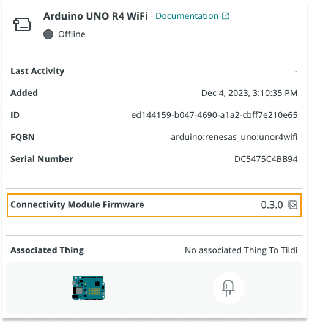

Arduino Cloud uses the Arduino Firmware Uploader tool to update supported connectivity modules:

These boards and modules are supported[^deprecated]:

| Board                 | Module   |
|-----------------------|----------|
| Arduino UNO R4 WiFi   | ESP32-S3 |
| Arduino Portenta C33  | ESP32-C3 |
| Arduino MKR WiFi 1010 | NINA     |
| Arduino NANO 33 IoT   | NINA     |
| Arduino Nano RP2040   | NINA     |

[^deprecated]: MKR 1000 WiFi and MKR Vidor 4000 are not supported in the Arduino Firmware Uploader used by Arduino Cloud. To update these boards, use Arduino IDE [2.2.1](https://github.com/arduino/arduino-ide/releases/tag/2.1.1) or Arduino Firmware Uploader [2.3.0](https://github.com/arduino/arduino-fwuploader/releases/tag/2.3.0). For more information, see the [Arduino Firmware Uploader user documentation](https://arduino.github.io/arduino-fwuploader/latest/deprecated/).

How to update the firmware:

* When you **add a new device** to Arduino Cloud, the connectivity module firmware is automatically updated.
* To update an existing device, follow these steps:
  1. Open the **[Device tab](https://app.arduino.cc/devices)**.
  2. Click on the row with your device's name. This will open a page with more information about your device.
  3. Find the **Connectivity Module Firmware** row and click it to update the firmware to the latest available version.

     

* Alternatively, you update an existing device by removing it and then adding it again. When adding the device, the firmware is automatically updated with the latest firmware version.
