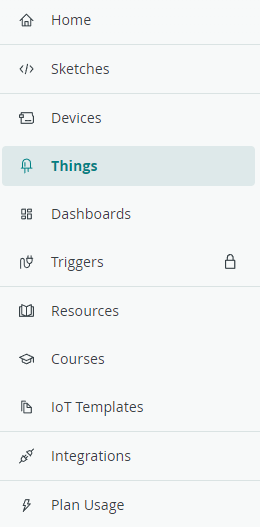
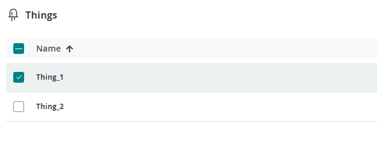

## We were not able to upload the template sketch

With [Arduino Cloud templates](https://app.arduino.cc/templates) you can quickly create a project for a compatible board (such as the MKR WiFi 1010). When importing a template you may experience this error:

This error is often caused by imported custom libraries conflicting with the built-in libraries used in the template. The error can be resolved by removing any custom libraries that may be causing the conflict.

You can find your custom libraries by opening the [Cloud Editor](https://create.arduino.cc/editor), clicking **Libraries** in the sidebar, and selecting the **Custom** tab. If you hover over a library with the cursor, a small arrow icon will appear. Click it and select **Delete library** to remove it.

## We were not able to import the template sketch

Sometimes the `Import Template` button will be disabled and this is because you might have exceeded your limits of having more than two Things connected to the Cloud.  You can free up a spot by removing one of the Things.

### How to delete "Things"

1. Go to the [Things](https://app.arduino.cc/things) tab, it can be found on the sidebar menu to the left.

    

1. Select the **Things** you want to delete.

    

1. In the bottom right corner, press the  logo.

1. Press `Yes, Delete`.

    
