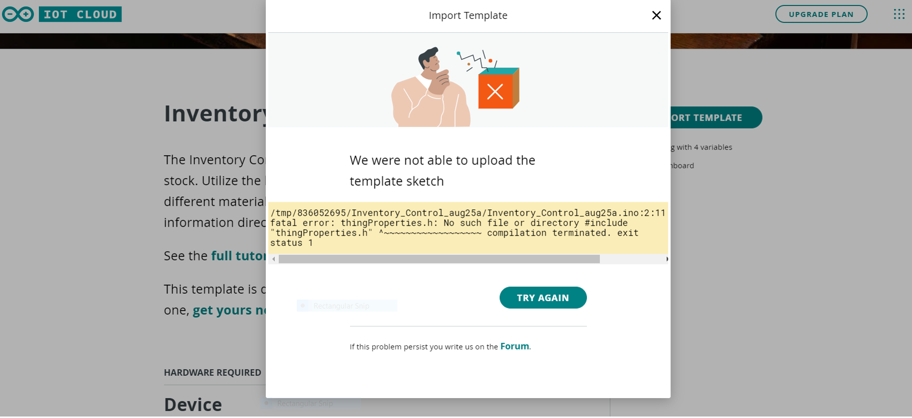

With [IoT Cloud templates](https://create.arduino.cc/iot/templates) you can quickly create a project for a compatible board (such as the MKR WiFi 1010). When importing a template you may experience this error:

This error is often caused by imported custom libraries conflicting with the built-in libraries used in the template. The error can be resolved by removing any custom libraries that may be causing the conflict.

You can find your custom libraries by opening the [Web Editor](https://create.arduino.cc/editor), clicking **Libraries** in the sidebar, and selecting the **Custom** tab. If you hover over a library with the cursor, a small arrow icon will appear. Click it and select **Delete library** to remove it.

