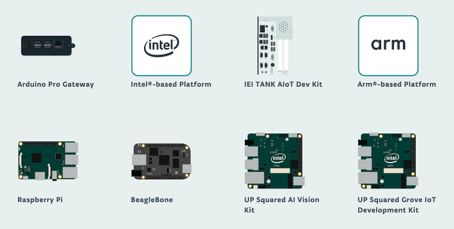

The [Arduino IoT Cloud](https://create.arduino.cc/iot/) supports several Arduino and third-party boards, as well as a number of Linux devices.

---

## Arduino boards

The following Arduino boards are supported.

* [MKR 1000 WiFi](https://store.arduino.cc/arduino-mkr1000-wifi)
* [MKR WiFi 1010](https://store.arduino.cc/arduino-mkr-wifi-1010)
* [MKR WAN 1300](https://store.arduino.cc/arduino-mkr-wan-1300-lora-connectivity-1414)
* [MKR WAN 1310](https://store.arduino.cc/mkr-wan-1310)
* [MKR GSM 1400](https://store.arduino.cc/arduino-mkr-gsm-1400)
* [MKR NB 1500](https://store.arduino.cc/arduino-mkr-nb-1500-1413)
* [Nano RP2040 Connect](https://store.arduino.cc/nano-rp2040-connect)
* [Nano 33 IoT](https://store.arduino.cc/arduino-nano-33-iot)
* [Portenta H7](https://store.arduino.cc/portenta-h7)

---

## Third-party boards

Supported third-party boards and other devices can be connected to the platform:

* LoRa® devices
* A wide range of 3rd party boards based on the ESP32 and ESP8266 microcontrollers

> To get the most current list of supported devices, you can go to *[Devices](https://create.arduino.cc/iot/devices) > Add Device > Set up a 3rd Party device* and view the respective *Select model* dropdowns for ESP32 and ESP8266.

---

## Linux devices

You can configure a number of Linux devices with the IoT Cloud in the [Manager for Linux](https://create.arduino.cc/getting-started/#cloud-devices).

The following Linux devices are supported.

* Arduino Pro Gateway
* Intel®-based platforms
* IEI TANK AIoT Dev Kit
* Arm®-based platforms
* Raspberry Pi
* BeagleBone
* UP Squared AI Vision Kit
* UP Squared Grove IoT Development Kit
