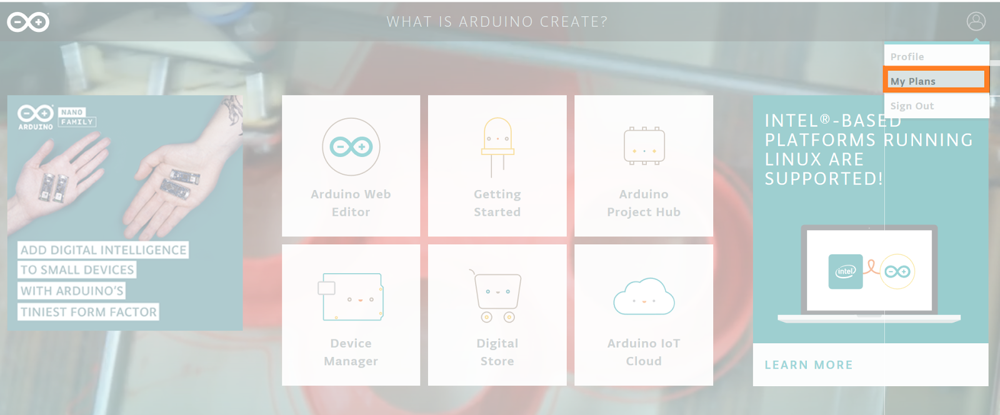

This quick guide will show you to check the data usage on the Arduino Sim card. Please follow the instructions step by step:

## Steps

1. Go to [arduino.cc](https://create.arduino.cc/) website and click 'SIGN IN' on the top right corner icon if you haven't done so yet. Make sure you login with the same Arduino credentials you used to register the subscription.

2. Once you are signed in, click on the top right of the signed-in account icon and select the 'MY PLANS' tab.

   

3. Select the 'My PLANS' tab and you will find your Arduino Sim card subscription.

   

4. Finally, click on the 'SHOW ALL' option to check the data usage of the Sim card.

   
