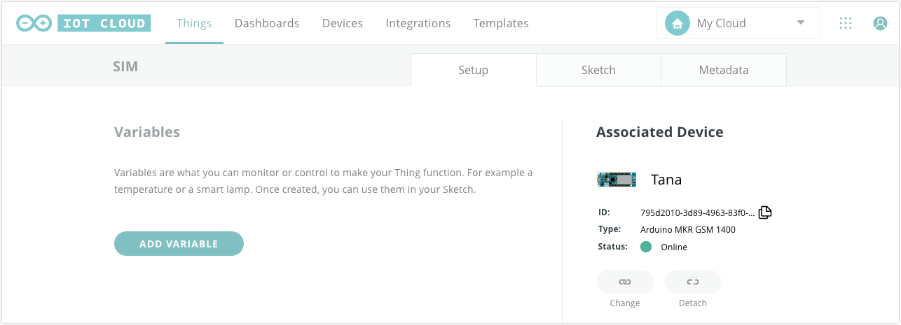
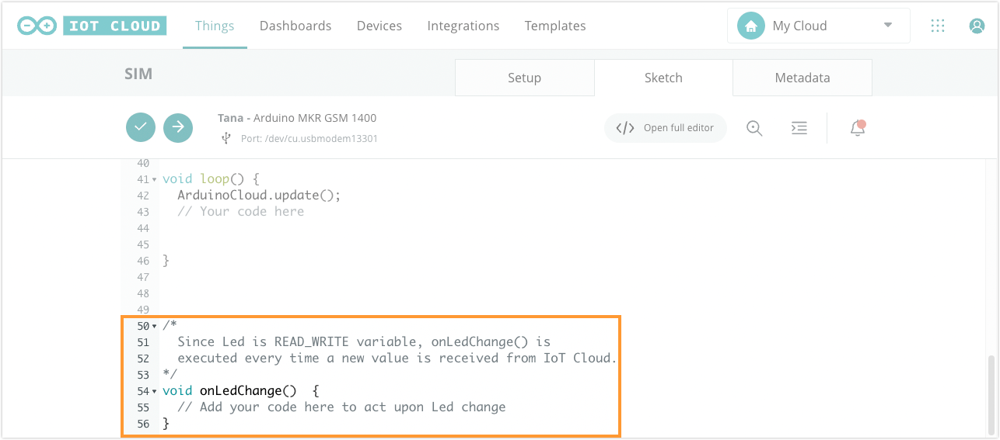

The [Arduino MKR GSM 1400](https://store.arduino.cc/arduino-mkr-gsm-1400-1415) has SIM connectivity and can be connected to the Arduino Cloud remotely. Here you'll learn how to configure a cellular connection and test it with an example sketch.

## What you'll need

* An Arduino MKR GSM 1400
* An [activated SIM card from Arduino](https://support.arduino.cc/hc/en-us/articles/360021543440) or some other service provider.
* A GSM/3G antenna with a micro UFL connector (such as the one included in the [cellular kit](https://store.arduino.cc/arduino-sim-mkr-gsm-1400-cellular-kit-1417)).

---

## Getting started

1. Slide the SIM card into the tray with the metal contacts facing the board.

2. Attach the antenna to the micro UFL port. Make sure the connector is lined up with the port and apply firm pressure.

The micro UFL port and the SIM tray are highlighted respectively in the image below.


---

<a id="set-up-instructions"></a>

## Set up with Arduino Cloud

### 1. Add Arduino MKR GSM 1400 as a device

1. Connect the board to your computer.

2. Go to [Arduino Cloud](https://app.arduino.cc/)

3. Click the **Devices** tab, then click **Add device**. Choose to set up an Arduino or 3rd party device depending on your device.

4. After a short while, your device should be found. Click **Configure** to proceed.

5. Follow the instructions to configure your device.

<a id="creating-a-thing"></a>

### 2. Configure a Thing

1. Go to the [Things tab](https://app.arduino.cc/things).

2. Click the **CREATE** button in the top-right corner to create a new Thing. You can replace the default "Untitled" name with your own, such as "SIM".

3. Under the **Associated Device** heading, click the **Select Device** button and select your MKR GSM 1400.

   

4. Under the **Network** heading, click the **Configure** button.

   

5. Enter your network parameters. If you are configuring an Arduino SIM, use the following parameters:

   <table>
    <tr>
      <th>APN</th>
      <td>prepay.pelion</td>
    </tr>
    <tr>
      <th>PIN</th>
      <td>0000</td>
    </tr>
    <tr>
      <th>Username</th>
      <td>arduino</td>
    </tr>
    <tr>
      <th>Password</th>
      <td>arduino</td>
    </tr>
   </table>

   Otherwise, use the parameters provided by your SIM provider.

6. Click the **SAVE** button.

### 3. Upload the sketch

1. Open the **Sketch** tab.

2. Click the **Upload** button to upload the updated sketch.

3. Go back to the **Setup** tab.

4. After a short while, your device should come online. You may have to refresh the page.

   

---

## Test your remote connection

To test the connection, we can set up a Dashboard widget that will toggle an LED on the board. You'll need a Thing that's been associated with the device and configured for the network, like the one set up in the [previous instructions](#set-up-instructions).

### 1. Prepare the sketch

1. Go to the [Things tab](https://app.arduino.cc/things) and open your Thing.

2. Click **Add variable**, or the **Add** button if a variable has already been added.

3. Enter the following settings for your variable and click **Add variable** to save.

   * **Name:** led
   * **Type:** Boolean
   * **Variable Permission:** Read & Write
   * **Variable Update Policy:** On Change

4. Open the Sketch tab of your Thing.

5. In the editor, scroll down and find the `onLedChange()` function.

   

6. Edit the `onLedChange()` function to look like this:

   ```arduino
   void onLedChange() {
     Serial.print("led: " + led);
     digitalWrite(LED_BUILTIN, led);
   }
   ```

7. Click the  **Upload** button and wait for the process to complete.

### 2. Use the variable in a dashboard

1. Open the [Dashboards tab](https://app.arduino.cc/dashboards).

2. Open an existing dashboard, or click **Build Dashboard** to create a new one.

3. Click the  icon to enable editing.

4. Click the **Add** button to open the widget selection menu.

5. Click the **Things** tab and select the name of your Thing from the previous step.

   

6. Make sure the `led` variable is selected and click **Create Widgets**.

   

7. A new switch widget will be added to your dashboard. When the switch button is clicked, the IoT will change the `led` cloud variable, triggering `onLedChange()` and changing the state of the LED on the board. You can now disconnect the board from your computer and power it from another source, such as a wall charger. After a short while, the board will connect to the Arduino Cloud. You can then toggle the LED remotely using the Dashboard switch.
