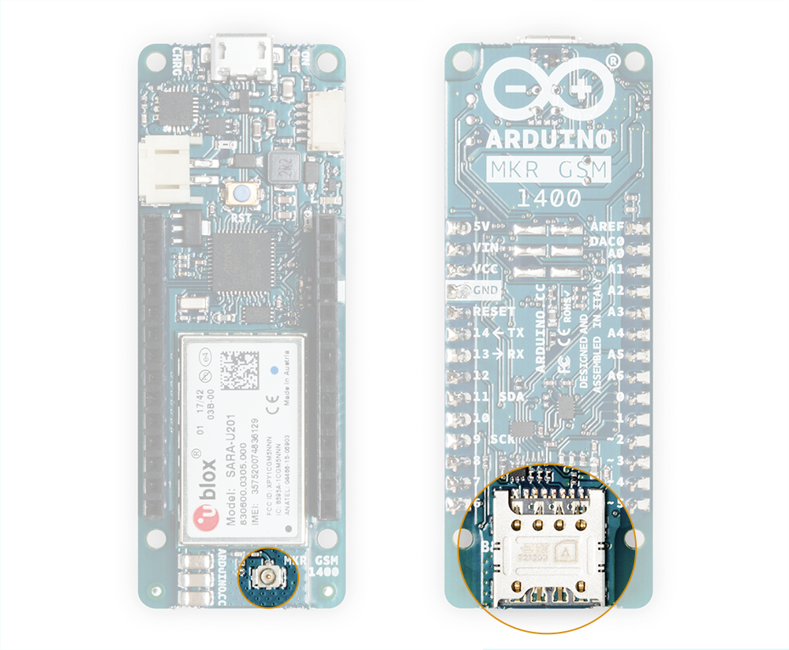
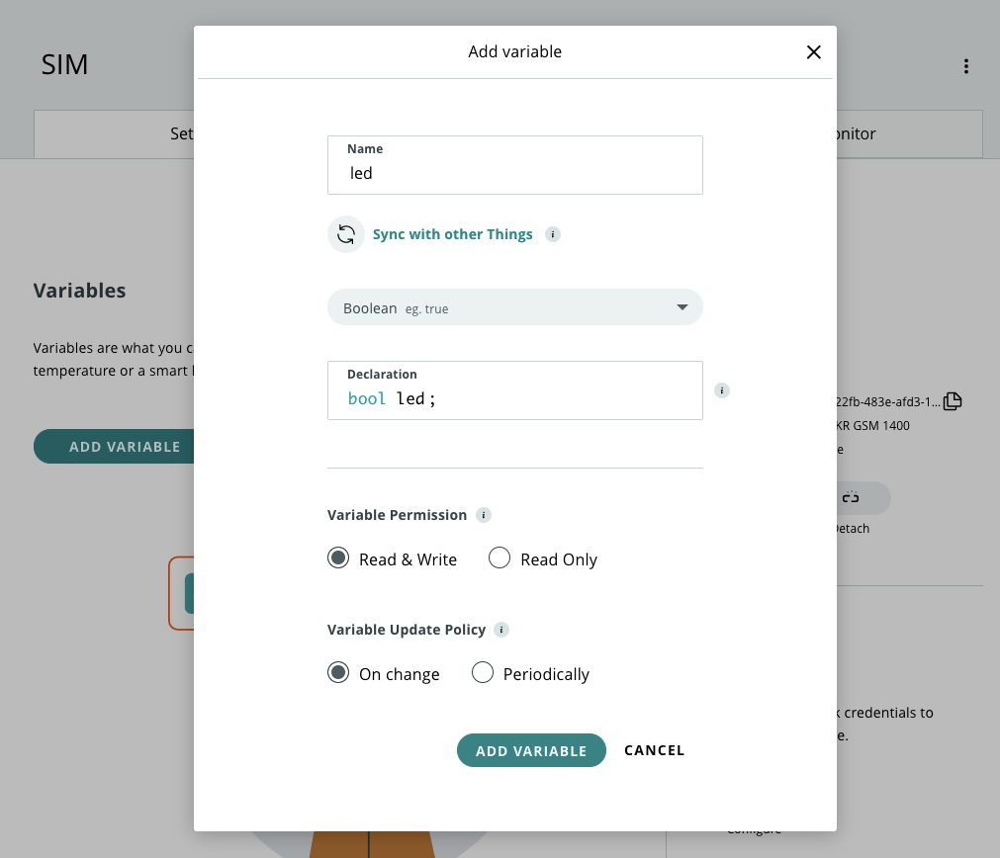
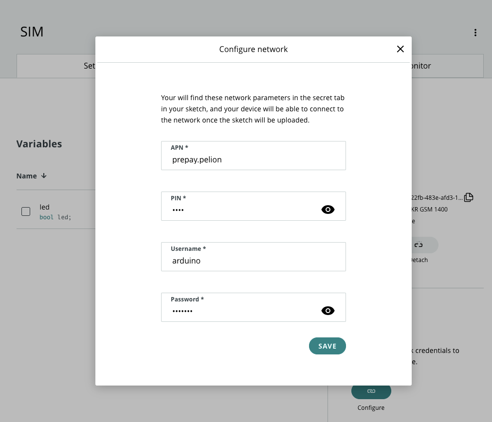
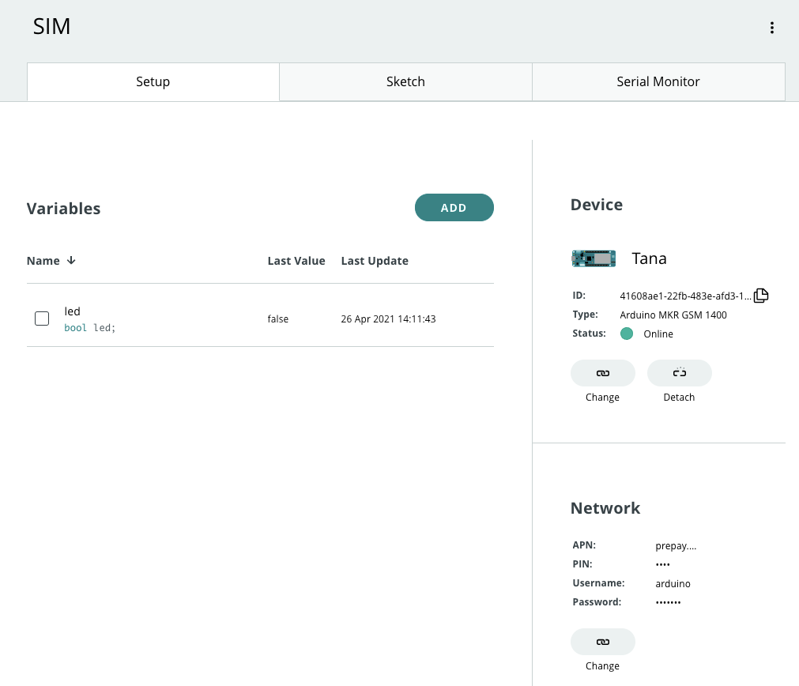
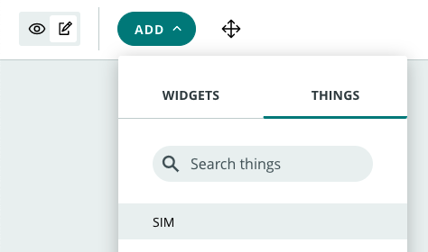
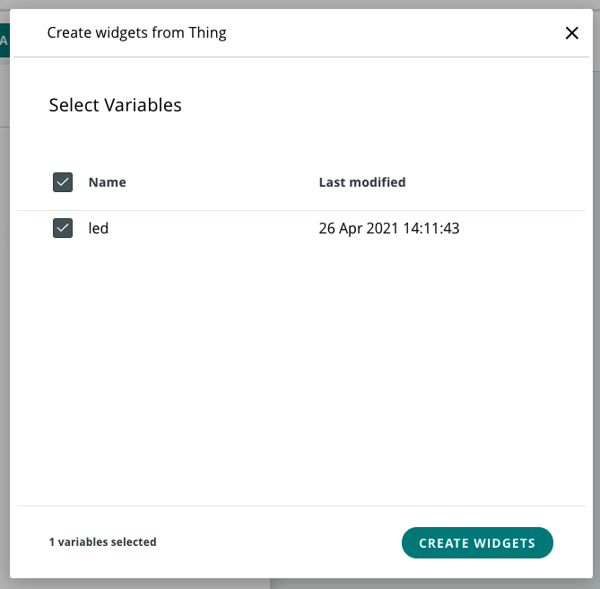
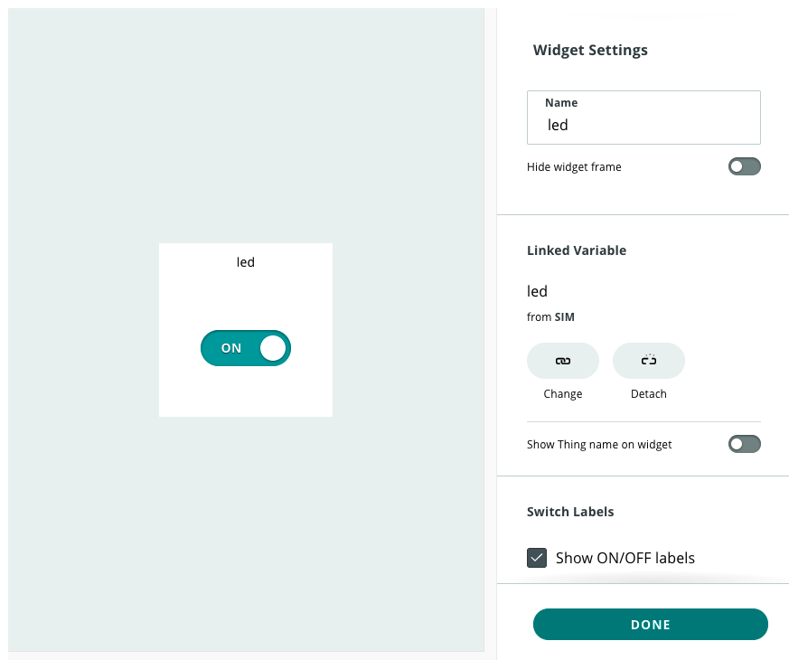
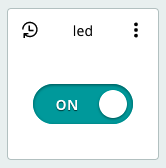

The [Arduino MKR GSM 1400](https://store.arduino.cc/arduino-mkr-gsm-1400-1415) has SIM connectivity and can be connected to the Arduino IoT Cloud remotely. Here you'll learn how to configure a cellular connection and test it with an example sketch.

## What you need

* An Arduino MKR GSM 1400
* An [activated SIM card from Arduino](https://support.arduino.cc/hc/en-us/articles/360021543440) or some other service provider.
* A GSM/3G antenna with a micro UFL connector (such as the one included in the [cellular kit](https://store.arduino.cc/arduino-sim-mkr-gsm-1400-cellular-kit-1417)).

---

## Getting started

1. Slide the SIM card into the tray with the metal contacts facing the board.

2. Attach the antenna to the micro UFL port. Make sure the connector is lined up with the port and apply firm pressure.

The micro UFL port and the SIM tray are highlighted respectively in the image below.



---

## Connecting your board to the IoT Cloud

1. Connect the board to your computer.

2. Go to [Arduino IoT Cloud](https://cloud.arduino.cc/iot/devices)

3. Click the **Devices** tab, then click **Add device**. Choose to set up an Arduino or 3rd party device depending on your device.

4. After a short while, your device should be found. Click **Configure** to proceed.

5. Follow the instructions to configure your device.

---

## Creating a sketch

> You can skip step 1 if you already have a Thing with a sketch prepared, but you still need to add the led variable if you want to follow the example later in this article.

The network parameters will be written to the `thingProperties.h` and `Secret` sketch files. But a sketch is only generated when a variable is added, so we'll do that first. You can add any variable you like, but here we'll prepare a variable to use in an example later in this article.

1. Open the Things tab and click **Create Thing**. Click on 'Untitled' and give it a name, such as 'SIM'.

2. Under the **Device** heading, click the button and associate the GSM 1400.

3. Click **Add variable** and configure the variable with the below settings. When you're done, click **Add Variable**.

   

4. Your sketch will now be generated and can be viewed in the Sketch tab.

---

## Configuring the network parameters

1. Under the Network heading, click the **Configure** button. If you are configuring an Arduino SIM, use the following parameters.

   <table>
    <tr>
      <th>APN</th>
      <td>prepay.pelion</td>
    </tr>
    <tr>
      <th>PIN</th>
      <td>0000</td>
    </tr>
    <tr>
      <th>Username</th>
      <td>arduino</td>
    </tr>
    <tr>
      <th>Password</th>
      <td>arduino</td>
    </tr>
   </table>

   Otherwise, use the parameters provided by your SIM provider.

   

2. Go to the sketch tab and upload the code to your board.

3. After a short while, your board should be online.

   

---

## Testing your remote connection

To test the connection, we can set up a Dashboard widget that will toggle an LED on the board.

You will need a Thing configured with the `led` from [the previous step](#creating-a-thing).

1. Open the Sketch tab of your Thing.

2. Scroll down to the bottom of the sketch and add this code.

   ```
   void onLedChange() {
     Serial.print("led: " + led);
     digitalWrite(LED_BUILTIN, led);
   }
   ```

3. Upload the changes to the board.

4. Open the Dashboards tab in the top bar. Open an existing dashboard, or click **Build Dashboard** to create a new one.

5. Click the notepad icon to enable editing. Then click *Add > Things* and select your Thing.

   

6. Make sure the `led` variable is selected and click **Create Widget**.

   

7. Click **Done** to accept the default settings.

   

8. A new switch widget will be added to your dashboard.

   

When the switch button is clicked, the IoT will change the `led` cloud variable, triggering `onLedChange()` and changing the state of the LED on the board. You can now disconnect the board from your computer and power it from another source, such as a wall charger. After a short while, the board will connect to the IoT Cloud. You can then toggle the LED remotely using the Dashboard switch.
