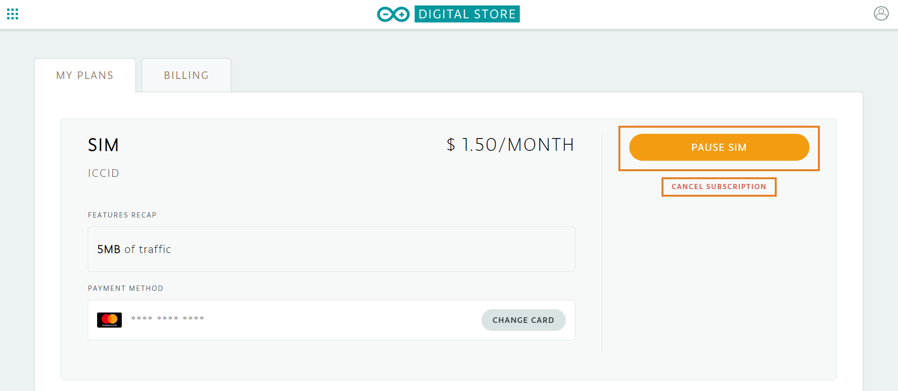
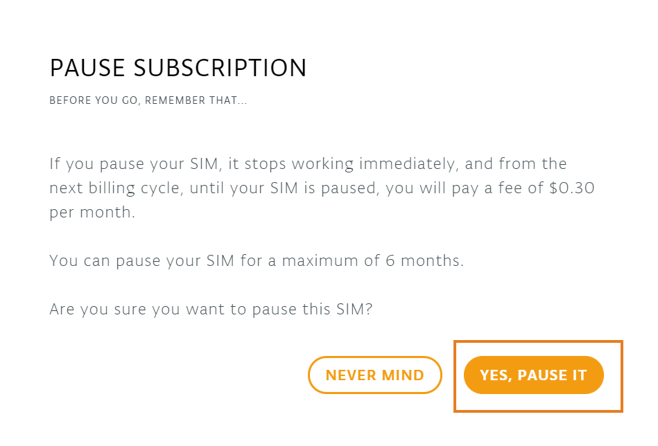
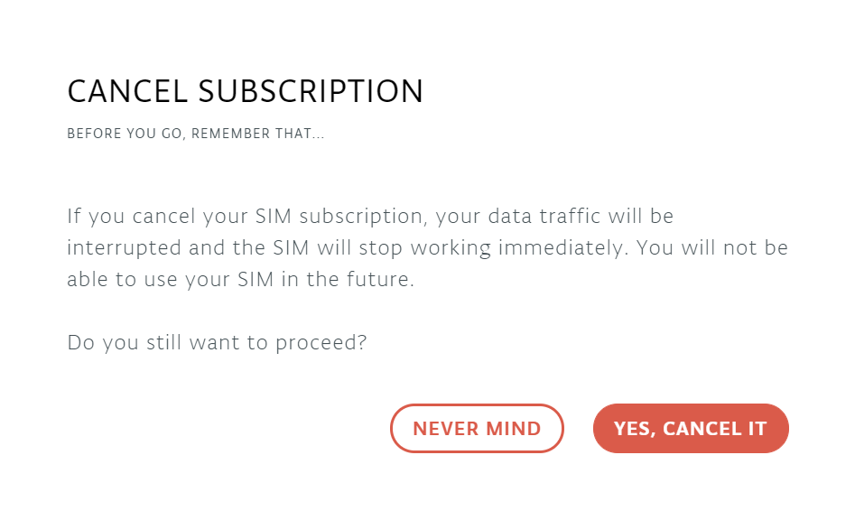

This quick guide will show you different ways to modify your Arduino SIM card subscription. It is possible to cancel your subscription at any time but it is also possible to pause the subscription. Read below to learn what these terms mean and how to do apply the changes.

## Steps

1. Go to [arduino.cc](https://www.arduino.cc/) and click 'SIGN IN' on the top right corner icon if you haven't done so yet. Make sure you login with the same Arduino credentials you used to register the subscription.

2. Once logged in, go to your [Arduino Cloud Subscription Plans](https://store.arduino.cc/digital/subscriptions/plans). There you will find all different plans you are subscribed to. Scroll down until you find you *SIM Plan*.

   

3. Then you will see two different options available on the right side:
   * **Pause your SIM**: If you pause your SIM, it stops working immediately, and from the next billing cycle, until your SIM is paused, you will pay a fee of $0.30 per month. This is a good option if you are not planning to use the SIM for a while and do not wish to pay full price for the plan. Then, you can resume the subscription and the same SIM card will be active again.

    

   * **Cancel subscription**: If you cancel your SIM subscription, your data traffic will be interrupted and the SIM will stop working immediately. You will not be able to use your SIM in the future.

       

4. Click on the desired option and confirm. Make sure you read and understand the warning before taking action.
   > Please note that your SIM can be paused for a maximum of 6 months and there is an ongoing paused fee of $0.30 USD per month plus applicable taxes. (n.b. the SIM cannot be paused during your free 90 day trial period).
