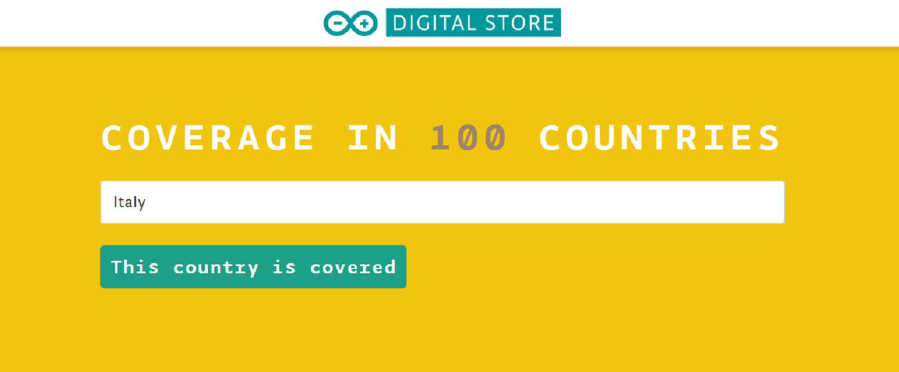
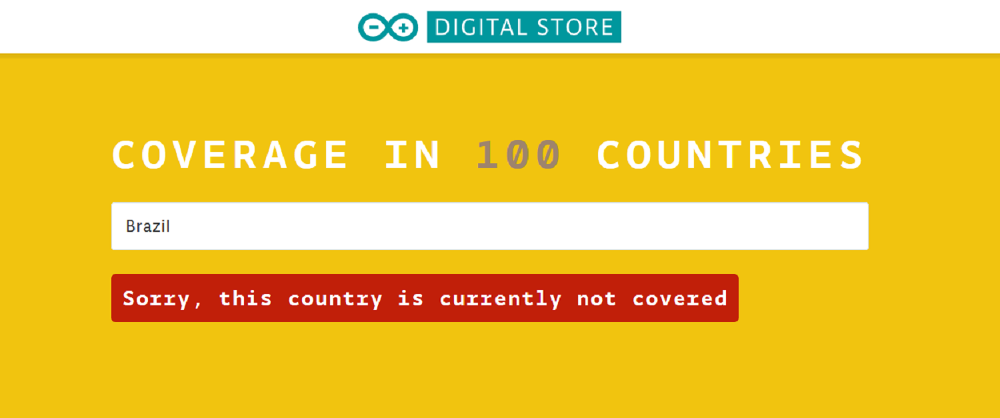

You can connect to the Arduino IoT cloud from over 100 countries using the Arduino SIM card, enabling you to use your device around the globe.

To check if the country where your Arduino project will be placed is covered by the Arduino SIM card network, you can check [here](https://store.arduino.cc/digital/sim#) and scroll down to the section “Coverage in 100 countries”.

Once you type your country name, there are two potential outcomes. In case your country is covered by the network service you will see a message inside a green box saying “This country is covered”.

In case the country is not covered by the service you will get a message inside a red box saying “Sorry, this country is currently not covered”.

