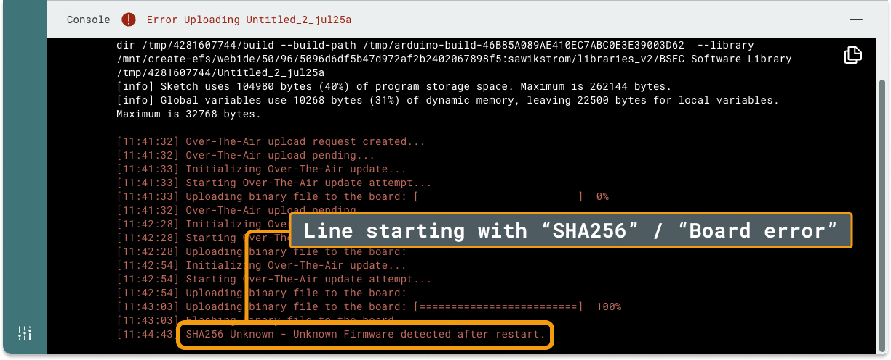

Learn how to resolve errors when uploading Over-the-Air (OTA) in the Cloud Editor.

Before you proceed, rule out other types of errors:

* If the message on the console panel bar says **"Error Verifying \<Sketch name\>"**, it means that the sketch could not be successfully compiled. See [If your sketch doesn't compile](https://support.arduino.cc/hc/en-us/articles/4402764401554-If-your-sketch-doesn-t-compile) instead.
* An Over-the-Air upload will only be attempted if the  OTA icon is visible to the right of the Upload button. If USB upload is also available, make sure that the OTA option is selected.

In this article:

* [Identifying the OTA error message](#identify-error)
* [Error reference for OTA uploads](#errors)

---

## Identifying the OTA error message {#identify-error}

When an Over-the-Air upload fails, you can find the error in the console output.

Follow these steps:

1. Find the console panel. If it is hidden, show it by clicking the button in the bottom-right corner.
2. Find the line that starts with "SHA256" or "Board error".
3. Find the instructions for that error in the [error reference](#errors).

---

## Error reference for OTA uploads {#errors}

In this section:

* [Board error - errorwriteupdatefilefail](#errorwriteupdatefilefail)
* [Board error - httpresponsefail](#httpresponsefail)
* [Board error - otadownloadfail](#otadownloadfail)
* [Board error - otaheadercrcfail](#otaheadercrcfail)
* [Board error - otastorageinitfail](#otastorageinitfail)
* [Board error - serverconnecterrorfail](#serverconnecterrorfail)
* [SHA256 mismatch - Unable to apply the new firmware. Previous firmware detected after restart](#sha256mismatch)
* [SHA256 Unknown - Unknown Firmware detected after restart.](#sha256unknown)

### Board error - errorwriteupdatefilefail {#errorwriteupdatefilefail}

This error indicates that the device's memory partition table is improperly formatted.

To resolve this issue, see [Reset the flash memory on STM32H747-based devices](https://support.arduino.cc/hc/en-us/articles/16206977438748-Reset-the-flash-memory-on-STM32H747-based-devices).

### Board error - httpresponsefail {#httpresponsefail}

This error can occur if the OTA update fails during the firmware download.

Follow these steps:

1. Ensure that the board has a stable connection to Arduino Cloud.
1. Avoid extensive calls to the `delay()` function or other blocking code inside the `loop()` function of your sketch.

### Board error - otadownloadfail {#otadownloadfail}

This error can occur if the OTA update fails during the firmware download.

Follow these steps:

1. Ensure that the board has a stable connection to Arduino Cloud.
1. Avoid extensive calls to the `delay()` function or other blocking code inside the `loop()` function of your sketch.

### Board error - otaheadercrcfail {#otaheadercrcfail}

The header of the downloaded file does not match the expected one, likely indicating that the file was corrupted during the download.

To resolve this issue, upload the sketch again.

### Board error - otastorageinitfail {#otastorageinitfail}

This error indicates that the device's memory partition table is improperly formatted.

To resolve this issue, see [Reset the flash memory on STM32H747-based devices](https://support.arduino.cc/hc/en-us/articles/16206977438748-Reset-the-flash-memory-on-STM32H747-based-devices).

### Board error - serverconnecterrorfail {#serverconnecterrorfail}

This error occurs when the device fails to connect to the firmware download endpoint.

To resolve this issue, ensure that the board has a stable connection to Arduino Cloud.

### SHA256 mismatch - Unable to apply the new firmware. Previous firmware detected after restart {#sha256mismatch}

This error means that the device restarted with a SHA (fw identifier) that is different from the target one and the SHA is equal to the one installed when the OTA process is started. This usually happens when the device restarts during the OTA process.

Follow these steps:

1. Ensure the device is connected to a stable and uninterrupted power source.
1. Upload a simple example sketch (such as BareMinimum) to prevent any resets caused by faulty code.
1. If you're unable to program the device, try putting it in bootloader mode.

### SHA256 Unknown - Unknown Firmware detected after restart. {#sha256unknown}

This error indicates that the device restarted with a new SHA (firmware identifier), which differs from both the target firmware and the original firmware. This suggests that another firmware was flashed on the device via a different method, such as USB, during the OTA update process.

Follow these steps:

1. Ensure there is no external device that is programming the board.
1. Repeat the upload process.

<!-- markdownlint-disable-file HC001 -->
