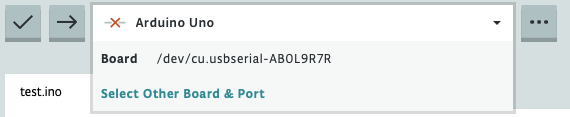

If the selected board in Arduino Cloud Editor could not be detected, the board selector will display a red cross.

Learn how to troubleshoot possible issues when connecting a board to the Cloud Editor.

---

## Troubleshooting

> **Note:** If you are using a Chromebook, make sure to install the <a class="link-up-right" href="https://play.google.com/store/apps/details?id=cc.arduino.create_editor">Arduino Cloud for Chromebook app</a>.

1. Make sure to select the connected board in the board selector. Sometimes the Cloud Editor will show the red cross icon and the name of a board that has been previously connected:

    

2. Check that your device is powered. One or more more LEDs should be lit.
3. Ensure you've connected your board with a working data USB cable.
4. If you haven't done so already, [install Arduino Create Agent](https://create.arduino.cc/getting-started/plugin/welcome).
5. [Check if the Arduino Create Agent is installed and running](https://support.arduino.cc/hc/en-us/articles/4980687506844-Check-if-the-Arduino-Create-Agent-is-installed-and-running).
6. Check if HTTPS certificates have been installed:
    1. Open the Arduino Create Agent menu (Look for the  icon in the top-right of the menu bar for macOS and Linux or in the bottom-right of the taskbar within the system tray, for Windows).
    2. If the **Generate and Install HTTPS Certificates** option is available, click it. If it's disabled, the certificates are already installed.
    3. Enter password if prompted.
    4. Refresh the browser window.

### Classic Nano boards and boards with generic USB chips

Classic Nano boards and some clone boards with generic USB chips will show up as **"Board"** in the board selector. When selecting a "Board" port you will be prompted to select the board type manually.

Note that:

* If you're using a classic Arduino Nano, you may need to [manually install FTDI drivers](https://support.arduino.cc/hc/en-us/articles/4411305694610-Install-or-update-FTDI-drivers).
* If you're using an Arduino-based "clone" board with a CH340 USB chip, you may need to [manually install CH340 drivers](https://sparks.gogo.co.nz/ch340.html).
