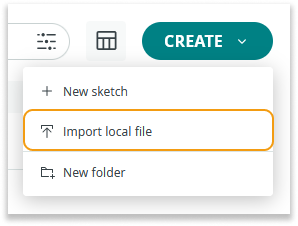

You can easily transfer all your sketches and libraries from the Arduino IDE to the Arduino Cloud Editor with just a few clicks. This feature enables you to secures your projects in the Arduino Cloud, giving you access from any computer.

Arduino Cloud Editor allows you to import sketches and files in the following formats:

- Single sketches in `.ino`, `.pde`, and `.zip` format.
- Libraries in `.zip` format.
- Zipped folders containing sketches and libraries.

> Note: Make sure your libraries are in a folder called ‘libraries’. Be sure not to mix sketches and libraries in the same folder.

## Steps

1. Find your sketchbook

   On your PC find out where your sketchbook folder is (it is called ‘Arduino’ unless you renamed it) and you will find it under the following directory:

- Windows: `C:\Users\{username}\Documents\Arduino`
- macOS: `/Users/{username}/Documents/Arduino`
- Linux: `/home/{username}/Arduino`

1. Zip your sketchbook

   Make a `.zip` pack of your sketchbook, you should obtain a file called `Arduino.zip`. Make sure it is in `.zip` format, any other archive formats will not work.

   

1. Import your sketchbook to the Cloud

   Go to the [Sketch tab](https://app.arduino.cc/sketches). Click the **Create** button in the top right corner. Then click **Import local file** in the dropdown menu.

   

   A pop-up with some instructions on how to import files into the Cloud Editor will be displayed. Press **Import** to continue.

   You will now see a file system window, select your `Arduino.zip` pack. Wait for the import process to finish. If your sketchbook is big (containing lots of files), this may take a while.

After the import process is complete, a popup will appear.

If you already have sketches with the same name on the online IDE, these sketches will fail to import to avoid conflicts.

If you have libraries in your sketchbook, another report will tell you those that got successfully imported. If you have existing custom libraries with the same names, it’ll prompt you to overwrite the existing ones. Be sure to proceed with caution!
