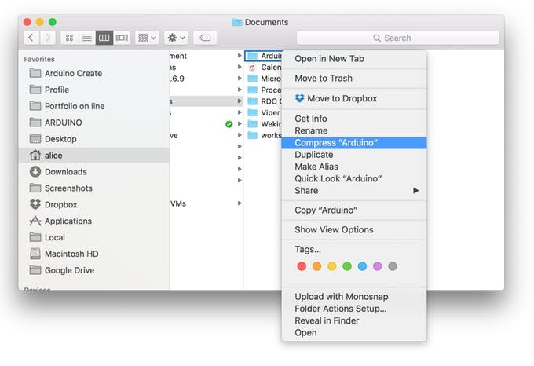

It is possible to import easily all your sketches and libraries from Arduino IDE (desktop Arduino software) to Arduino Cloud Editor (online version of Arduino IDE) in just a few clicks. This comes very handy as all your projects will be saved in Arduino Cloud and are accessible from any computer.

In addition, Arduino Cloud Editor allows you to import sketches and files in the following formats:

* Single sketches in `.ino`, `.pde` and `.zip` format.
* Libraries in `.zip` format.
* Zipped folders containing sketches and libraries.

> Note: Make sure your libraries are in a folder called ‘libraries’. Be sure not to mix sketches and libraries in the same folder.

## Steps

1. Find your sketchbook:

   On your PC find out where your sketchbook folder is (it is called ‘Arduino’, unless you renamed it) and you will find it under the following directory:

   * Windows: it’s usually under `My Computer/Documents/Arduino`
   * macOS: `User/Documents/Arduino`
   * Linux: `$HOME/Arduino`.

2. Zip your sketchbook:

   Make a `.zip` pack of your sketchbook, you should obtain a file called `Arduino.zip`. Make sure it is `.zip` format, any other archive formats will not work.

   

3. Import your sketchbook to the cloud:

   Go to the [Cloud Editor](https://support.arduino.cc/hc/en-us/articles/13809101080732-Open-the-Cloud-Editor). When you are logged in and ready, hit the import button on the sketchbook panel. A pop-up with some instructions on how to import files into the Cloud Editor will be displayed. Press “Import” to continue.

   You will now see a file system window, select your `Arduino.zip` pack. Wait for the import process to finish. If your sketchbook is big (containing lots of files), this may take a while.

   

4. You are done!

   Once the import process is done there will be two reports, one for sketches and one for libraries.

   If you already have sketches with the same name on the online IDE, these sketches will fail to import to avoid conflicts.

   If you have libraries in your sketchbook, another report will tell you those that got successfully imported. If you have existing custom libraries with the same names, it’ll prompt you to overwrite the existing ones. Be sure to proceed with caution!

   
