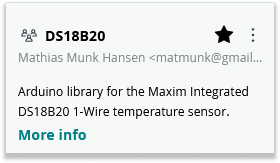
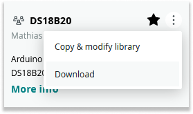
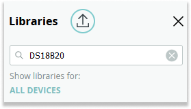

Several techniques can be used to make Arduino Cloud Editor pick a specific library when multiple libraries with the same name are available. One method is importing a copy of the library you want to use. Imported libraries are given preference over the pre-installed libraries ([full details here](https://arduino.github.io/arduino-cli/latest/sketch-build-process/#location-priorities-in-arduino-web-editor)). The technique works with any library, but we'll use the `DS18B20` library as an example in this guide.

> See [this forum post](https://forum.arduino.cc/index.php?topic=684441.msg4605368#msg4605368) if you're interested in learning alternative methods to the technique described in this guide.

1. From the menu on the left side of the Cloud Editor window, click on the "Libraries" tab.

   

1. Search for `DS18B20` in the search bar.

1. If the star to the right of the library is not already filled, click the star to add the library to your "Favorites".

   

1. Click on the three dots and then "Download Library".

    

1. Click the upward pointing arrow button (Import) above the search bar.

    

1. Select the downloaded library (DS18B20-1.0.0.zip).

1. Click the "Open" button.

1. Wait for the Cloud Editor to display the notification that the library was successfully imported.

    

This will cause the version of the library you imported to always be used by all sketches (1.0.0 in this case), so you may want to occasionally check to see if the library author has released a new version of the library and repeat the process with the new version in order to take advantage of any improvements or bug fixes that have been made to the library in the new release.

Again, this general technique will work for any library, it's not specific to the `DS18B20`.

Occasionally importing the stock library alone won’t cause it to have priority. The reason is that even though this gives the library the highest “Location Priority”, there are other factors that are prioritized higher. Most often, this would be the “Library Name/Folder Name Priority”. The solution is to give the imported library a perfect “Library Name/Folder Name Priority” score. Because the imported library is installed to a folder matching the library name, these are both controlled by the name value in the library.properties file. So this workaround requires you to edit the library.properties file before importing the library, as demonstrated [here](https://forum.arduino.cc/t/arduino-cloud-and-grove-ultrasonic-ranger-library/875053/6?u=pert).
