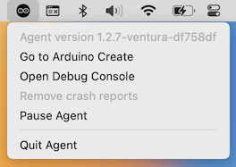

> **Note:** MacOS Ventura introduced new security requirements that resulted in issues running or installing the Arduino Create Agent. As a temporary solution, a special release[^1] was made for macOS Ventura with the auto-update feature disabled. These issues have been resolved in newer releases (1.3.0+).

Learn about using the Arduino Create Agent on macOS Ventura.

---

## Arduino Create Agent 1.3.0+ supports macOS Ventura

[^1]: <https://github.com/arduino/arduino-create-agent/releases/tag/1.2.7-ventura>

Here's how to get the latest version:

* If you're installing Arduino Create Agent for the first time, use the **[Arduino Create agent installation guide](https://create.arduino.cc/getting-started/plugin/welcome)** to get the latest version.
* If you previously installed the **1.2.7-ventura** version, see [Manually upgrade from Create Agent 1.2.7-ventura on macOS](#1.2.7-ventura-upgrade).
  * Unsure which version you have? See [Check your Create Agent version](#check-version).

---

## Check your Create Agent version

Here's how to check the version when the Create Agent is running:

1. In the macOS menu bar, find the  status menu icon.
2. Click the  icon to open the status menu.
3. Check the version number in the first row:

   

---

## Manually upgrade from Create Agent 1.2.7-ventura on macOS

Follow these steps to uninstall 1.2.7-ventura:

1. If the Create Agent is running, select  **> Quit Agent** in the menu bar.

2. Open Finder and go to your user folder. If you're having trouble finding it, right-click Downloads or Documents in the sidebar, and select _Show in Enclosing Folder_, or press <kbd>Shift</kbd> + <kbd>⌘</kbd> + <kbd>H</kbd>.

3. Open the Applications folder (`~/Applications`) within your user folder.

4. Manually remove the ArduinoCreateAgent folder, or run the `uninstall.app` inside it.

Now you're ready to install the latest Create Agent release:

1. Open the **[Arduino Create agent installation guide](https://create.arduino.cc/getting-started/plugin/welcome)**.

2. Follow the instructions. If you need help, see [Install the Arduino Create Agent](https://support.arduino.cc/hc/en-us/articles/360014869820-Install-the-Arduino-Create-Agent).
