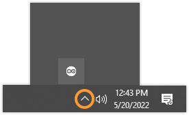

Learn how to check if the **Arduino Cloud Agent** is installed and running on your computer.

---

1. _Make sure the agent is not paused._ Look for the  icon in the top-right of the menu bar (macOS and Linux) or bottom-right of the taskbar (Windows), usually within the system tray:

   

   If you find it, click it. If a _Resume Agent_ option is available, the agent is currently paused. Click _Resume Agent_ to resume.

2. _Find and start the application_. Try searching for "Arduino Cloud Agent" or looking for it in your application menu. Alternatively, use the system's file browser and look in the default installation paths:

   * **Windows:** `C:\Users\{username}\AppData\Roaming\ArduinoCloudAgent\Arduino_Cloud_Agent.exe`

   * **macOS:** `/Applications/ArduinoCloudAgent.app` [^1]

   * **Linux** `home/{username}/ArduinoCloudAgent/ArduinoCloudAgent`

3. _Install or reinstall the agent._ If you can't find the application, follow the [online installation guide](https://create.arduino.cc/getting-started/plugin/welcome) to install the agent.

[^1]: Older versions of the agent can be found at:
      
      * `/Applications/ArduinoCreateAgent.app`
      * `Users/{username}/Applications/ArduinoCreateAgent`
