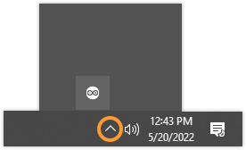

Learn how to check if the **Arduino Create Agent** is installed and running on your computer.

---

1. _Make sure the agent is not paused._ Look for the  icon in the top-right of the menu bar (macOS and Linux) or bottom-right of the taskbar (Windows), usually within the system tray:

   

   If you find it, click it. If a _Resume Agent_ option is available, the agent is currently paused. Click _Resume Agent_ to resume.

2. _Find and start the application_. Try searching for "Arduino Create Agent" or looking for it in your application menu. Alternatively, use the system's file browser and look in the default installation paths:

   * **Windows:** `C:\Users\{username}\AppData\Roaming\ArduinoCreateAgent\Arduino_Create_Agent.exe`

   * **macOS:** `Users/{username}/Applications/ArduinoCreateAgent/ArduinoCreateAgent.app`

   * **Linux** `home/{username}/ArduinoCreateAgent/ArduinoCreateAgent`

3. _Install or reinstall the agent._ If you can't find the application, follow the [online installation guide](https://create.arduino.cc/getting-started/plugin/welcome) to install the agent.
