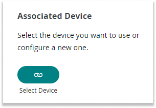
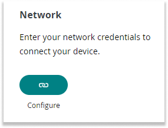
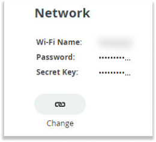

In this article:

- [Configure the network credentials of a Thing](#configure)
- [Change the network credentials of a Thing](#change)

## Configure the network credentials of a Thing {#configure}

1. Go to the [Things tab](https://app.arduino.cc/things) and select a Thing, or create a new Thing by clicking on the **+ Create Thing** button or the **+Thing** button in the top right corner.

1. If the Thing doesn't have an associated device, go to the **Associated Device** section and click the **Select Device** button. Get help [adding a device to Arduino Cloud](https://support.arduino.cc/hc/en-us/articles/360016495559-Add-and-connect-a-device-to-Arduino-Cloud#upload-sketch) if needed.

    

1. Go to the **Network Credentials** section and click the **Configure** button.

    

1. Enter your network credentials:

    - Wi-Fi: Enter your Wi-Fi name (SSID) and password (encryption key).
    - If using ESP32 and ESP8266: Enter the secret key that was provided when adding the device.
    - If using Arduino SIM: Use [these credentials](https://support.arduino.cc/hc/en-us/articles/360013825159-What-are-the-credentials-for-the-Arduino-SIM-card).
    - If using Arduino with LoRa®: The credentials are added automatically.

1. Go to the **Sketch** tab in the top right and upload the sketch to load the credentials on the board.

## Change the network credentials of a Thing {#change}

1. Go to the [Things tab](https://app.arduino.cc/things) and select the Thing that needs its network credentials updated.

1. Go to the **Network Credentials** section and click the **Change** button.

    

1. Enter your network credentials:
    - Wi-Fi: Enter your Wi-Fi name (SSID) and password (encryption key).
    - If using ESP32 and ESP8266: Enter the secret key that was provided when adding the device.
    - If using Arduino SIM: Use [these credentials](https://support.arduino.cc/hc/en-us/articles/360013825159-What-are-the-credentials-for-the-Arduino-SIM-card).
    - If using Arduino with LoRa®: The credentials are added automatically.

1. Go to the **Sketch** tab in the top right and upload the sketch to load the credentials on the board.
