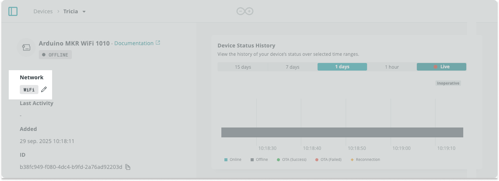

Learn how to configure the network credentials of an Arduino Cloud device.

---

Follow these steps:

1. Go to the [Device tab](https://app.arduino.cc/devices) and open your device.

1. Find the **Network** section:

   - If a network has been configured, it will display the network **name**.

   - If a network has **not** been configured, it will display the network **type**.

   

1. Select the network name or type to configure the credentials.

1. If prompted, create or associate an Thing to your device.

1. If prompted, select an update method and connect your board.

1. Configure your network credentials:
    - _Wi-Fi:_ Enter your Wi-Fi name (SSID) and password (encryption key).
    - _ESP32/ESP8266:_ Use the secret key that was provided when adding the device.
    - _Arduino device with LoRa®:_ The credentials are added automatically when adding the device.

1. One of the following will happen:

   - The network credentials will immediately be updated and you'll return to the device page.

   - A manual sketch upload will be required to update the credentials.

   If prompted, upload the sketch to update the network credentials on your device.
