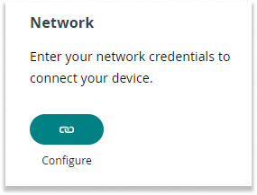
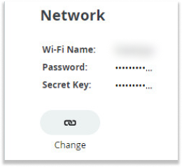

## Configuring a Thing without previously set network credentials

1. Go to the [Things tab](https://app.arduino.cc/things) and click the "+Thing" button in the top right corner.

    

1. After creating a Thing, select your device by clicking the "Select Device" button in the "Associated Device" section.

    

1. After selecting your device, you can enter your network credentials.

    

    Click the "Configure" button to enter your network credentials.

    - Wi-Fi: Enter your Wi-Fi name (SSID) and password (encryption key).
    - Arduino SIM: Use these credentials.
    - Arduino with LoRa®: The credentials are added automatically.
    - ESP32 and ESP8266: Enter the secret key that was provided when adding the device.

## Configuring network credentials with an imported template

1. Find a [Template](https://app.arduino.cc/templates) and click "Import Template" (If you have issues importing the template, you can find more information [here](https://support.arduino.cc/hc/en-us/articles/4408887422994-If-you-can-t-import-a-template-in-Arduino-Cloud))

1. Plug in your device and wait for it be detected. Once the device is detected, click on 'Configure' to continue.

    

1. Now that your device is detected and connected, the firmware of your Arduino device will be checked and updated if necessary to enhance connectivity. Follow the on-screen steps to proceed.

    

1. Once the device setup is complete, enter your network credentials.

    

## Configuring a Thing with previously set network credentials

1. Go to the [Things tab](https://app.arduino.cc/things) and select the Thing that needs its network credentials updated.

1. In your Thing's settings, find the Network section and click the button labeled "Change" to edit the network credentials.

    

1. Re-enter your Wi-Fi credentials with your Wi-Fi Name (SSID) and Password. Ensure there are no typos and the credentials match those set on your router.

1. Open the sketch and click the Upload button to properly apply the new network settings to your device.
