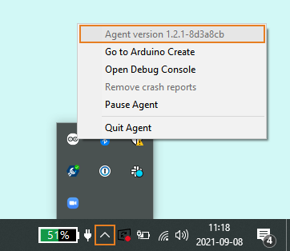
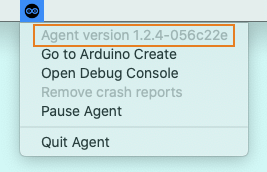

By default, the Arduino Create Agent updates automatically. To ensure you have the latest version, or for any other purpose, you can check which version is installed by following the steps for your system below.

> The latest release number can be found in the [source repository](https://github.com/arduino/arduino-create-agent).

## Windows

1. Make sure the Create Agent is running.

2. Find the Arduino icon in the System Tray, on the right of the Task Bar. If it's not pinned to the Task Bar you can find it by clicking the arrow icon.

3. Right-click on the Arduino icon and see the version number in the first row.

   

## macOS

1. Make sure the Create Agent is running.

2. Find and click the Create Agent icon in the menu bar.

3. See the version number in the first row.

   

## Linux

1. Make sure the Create Agent is running.

2. Find and click the Create Agent icon in the menu bar.

3. See the version number in the first row.

   
