Arduino Cloud uses its own agent to be the middle man between Arduino's Web Editor and IoT Cloud and your computer. In this article we'll explain how to install it in your system (Windows, Mac, and Linux Ubuntu).

## What you'll need

* Working Internet connection
* Arduino board to test the agent

> * Be sure that you have **administrator permission** on your machine; if the computer you are using is not your own personal computer, ask your IT administrator for an upgraded profile.
> * Sometimes the agent installation can be blocked by the firewall or antivirus software; in the latter case, you can try to **add the agent to your Antivirus whitelist**.

## Downloading the Installation wizard

1. Got to the [Arduino Create agent installation guide](https://create.arduino.cc/getting-started/plugin/welcome). Then click `Start`.

   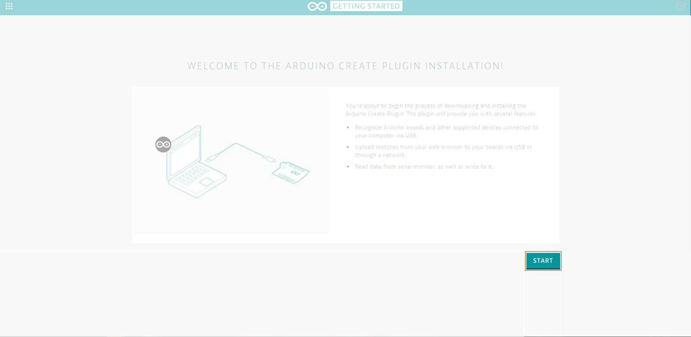

2. You will be now shown the different steps to follow through the browser, as well as the option to download the agent if you don't have the installer yet, in this case click `Download`.

   This will download different file types for different operating systems, but the installation is the same for all of them:

   * Windows: `.exe` file
   * macOS: `.dmg` file
   * Linux: `.tar.gz` file

   If you already have the installer, click `Skip`, and you will be taken directly to the agent connection test.

   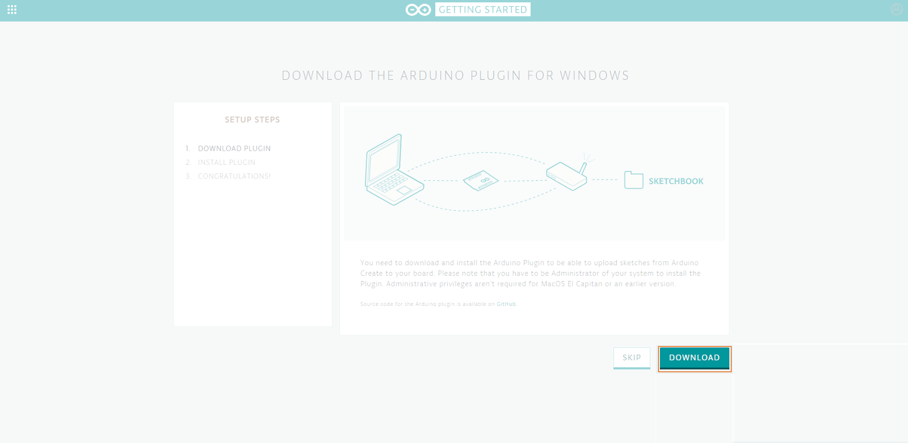

3. After downloading, you will see now in the browser some general instructions on what to do with the downloaded file.

   Go to the next section to follow the Installer instructions. This webpage will now wait until the agent is installed.

   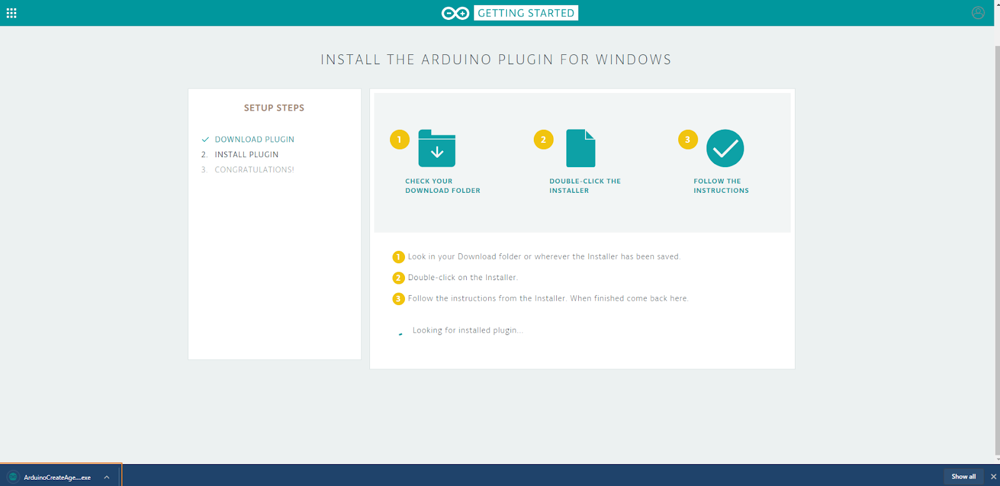

## Running the downloaded installation Wizard

1. Once the download is completed, execute the file to start the installation wizard, then click on `Next`.

   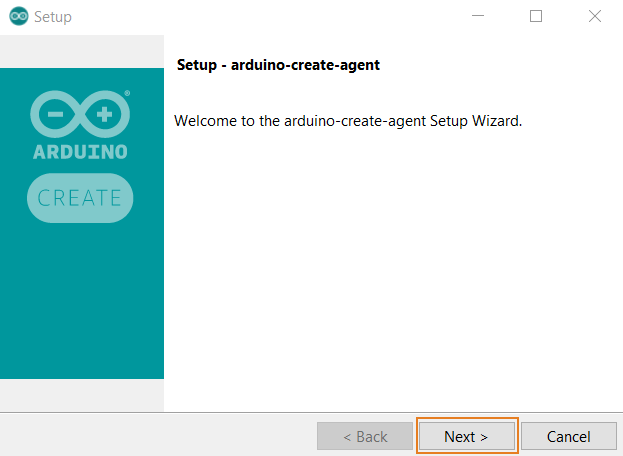

2. Check the license agreement, if you agree, check the `I accept the agreement` option, then `Next`.

   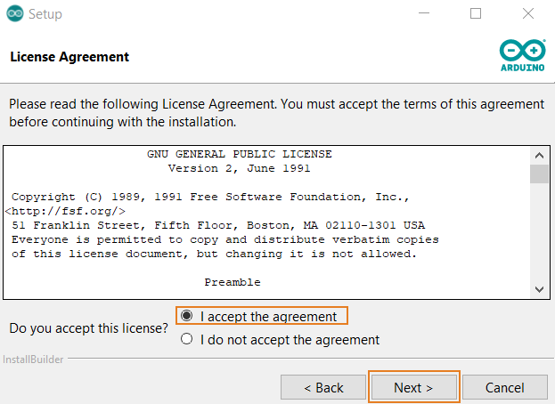

3. Under `Installation Directory`, you can select the location for files to be installed, then click `Next`.

   > The default location will be different for different Operative Systems:
   >
   > * Windows: `C:\Users\<USERNAME>\AppData\Roaming\ArduinoCreateAgent`
   > * macOS: `Macintosh HD\Users\<USERNAME>\Applications\ArduinoCreateAgent`
   > * Linux: `home\ubuntu\ArduinoCreateAgent`

   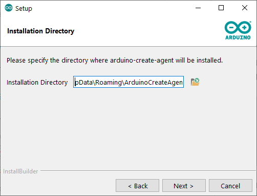

4. Under `Browser Support`, select ‘Yes’ if you plan to use the agent in a browser other than Firefox or Google; or select ‘No’ if you plan to use the agent only in Google or Firefox, then click `Next`.

   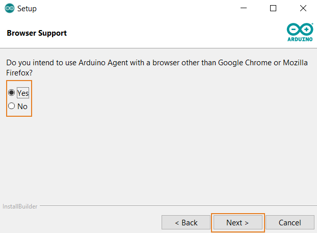

5. You will now get an "all ready to begin" notification, click next to get the installation started.

   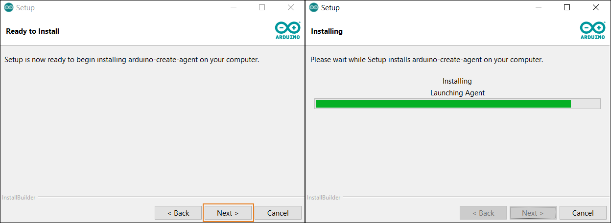

   > When installing in Windows, you will be asked for permission to install some needed certificates and drivers, click `Yes` in both cases.

   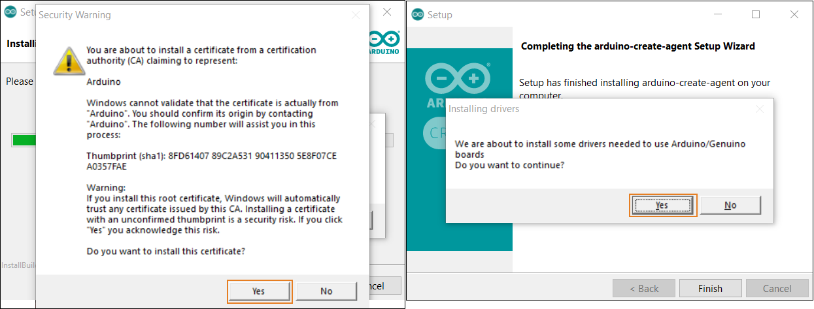

6. You are done with the installation! Click on `Finish`.

   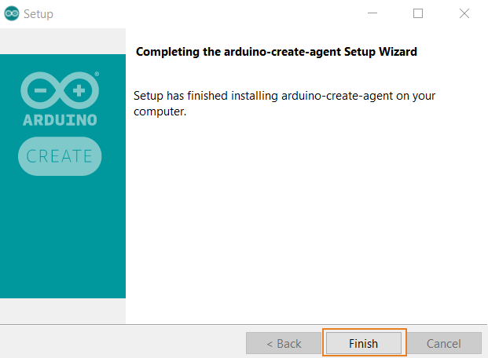

7. You can now go back to your browser and use your boards in the [Arduino Web Editor](https://create.arduino.cc/editor) and [IoT Cloud](https://create.arduino.cc/iot/)!

   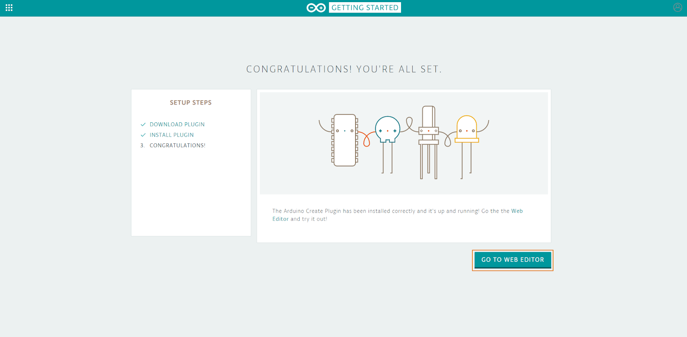

  Tags: como instalo la aplicacion

