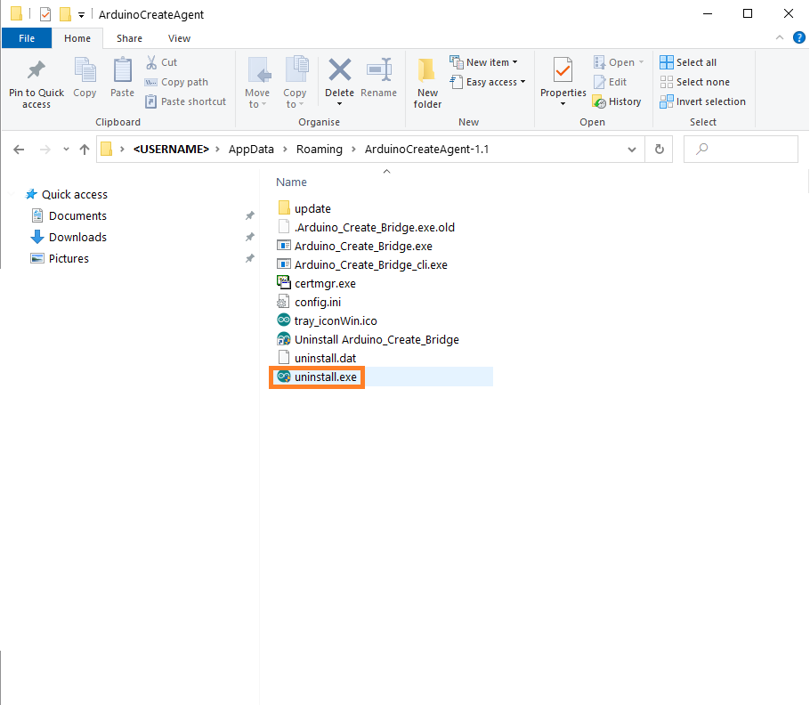

Arduino Cloud uses its own agent to be the middle man between Arduino's Web Editor and IoT Cloud and your computer. But sometimes the agent can malfunction or just not be useful anymore. Use this article to completely remove the agent from your computer.

## What you'll need

* Arduino Create agent installed

## Steps

1. Go to the folder chosen when the agent was installed.

   * Windows: `C:\Users\<USERNAME>\AppData\Roaming\ArduinoCreateAgent`
   * macOS: `Macintosh HD\Users\<USERNAME>\Applications\ArduinoCreateAgent`
   * Linux: `home\ubuntu\ArduinoCreateAgent`

   > If cannot find the folder in this paths, try searching for the folder "ArduinoCreateAgent".

2. Look for the uninstall file and execute it, this will remove the agent completely.

   

3. Done! If you want, you can now also remove the folder where the plug in was previously installed.
