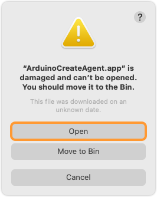
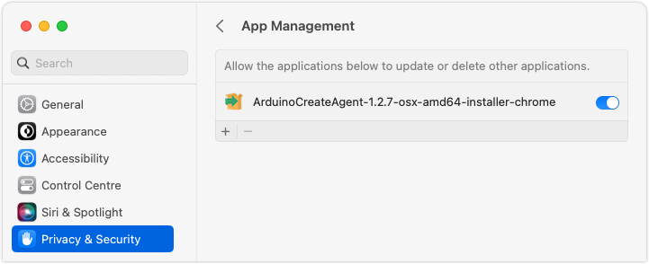

Currently, you may experience some issues running or installing the Arduino Create Agent on macOS Ventura.

New security requirements in macOS Ventura may trigger one of these errors:

* `"ArduinoCreateAgent.app" is damaged and can't be opened`
* `Error changing permissions`

Follow these steps to solve the issue:

1. [Intall version 1.2.7](#install).
2. If the issue persists, try the [workarounds](#workarounds).

---

<a id="install"></a>

## Install version 1.2.7 (recommended solution)

Version **1.2.7-ventura** is fully compliant with the security requirements enforced by macOS Ventura.

Download the version for your browser here:

* [Safari](http://downloads.arduino.cc/CreateAgent/Stable/ArduinoCreateAgent-1.2.7-ventura-osx-amd64-installer-safari.dmg)
* [Chrome](http://downloads.arduino.cc/CreateAgent/Stable/ArduinoCreateAgent-1.2.7-ventura-osx-amd64-installer-chrome.dmg)
* [Firefox](http://downloads.arduino.cc/CreateAgent/Stable/ArduinoCreateAgent-1.2.7-ventura-osx-amd64-installer-firefox.dmg)

> **Note:** This version has the auto-update functionality disabled. When a new version is released, a notification will be displayed asking you to manually upgrade. The next version will restore the auto-update functionality.

---

<a id="workarounds"></a>

## Workarounds

### "ArduinoCreateAgent.app" is damaged and can't be opened

When opening Arduino Create Agent you may get this error:

```
"ArduinoCreateAgent.app" is damaged and can't be opened.
You should move it to the bin.
This file was downloaded at an unknown date.
```

Follow these steps:

1. Open the Create Agent folder in Finder. By default it is located within your user folder, under `~/Applications/ArduinoCreateAgent`, and **not** in the main Application folder.

2. Right-click on ArduinoCreateAgent.app and select Open.

3. Force open the application by clicking **Open**.

   

### Error changing permissions

When running the installer, you may get an error like this:

```
Error changing permissions to 040755 in <installation path>
```

Follow these steps:

1. Open System Settings from the Dock or select _Apple menu > System Settings_ in the menu bar.

2. Open _Privacy & Security > App Management_.

3. Allow app management for the installer application.

If the installer is not in the list, click the **+** button and add it.


