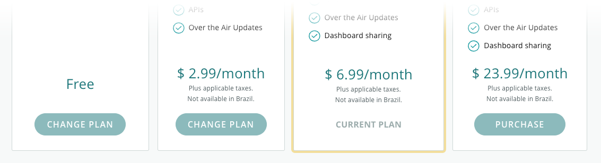
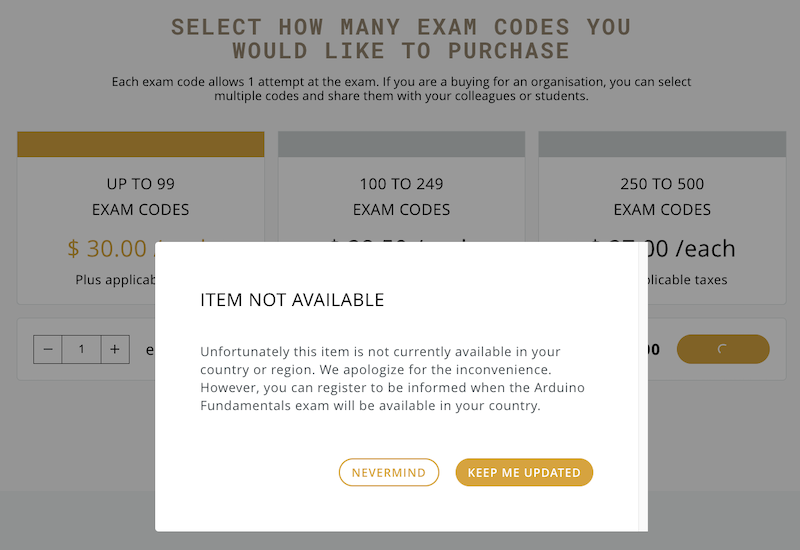

We are currently unable to provide Arduino services in some countries or regions. Notable examples include _Serbia, and Montenegro_.

These restrictions apply to affected countries and regions:

## Arduino Cloud

* You cannot sign up for a paid subscription. In the store, the Purchase button will be grayed-out.
* You are still welcome to use the free plan.

 

## Arduino Certification Exam

If you try to purchase an exam code, an **ITEM NOT AVAILABLE** message will appear.

