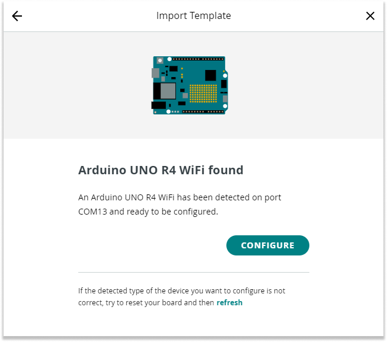
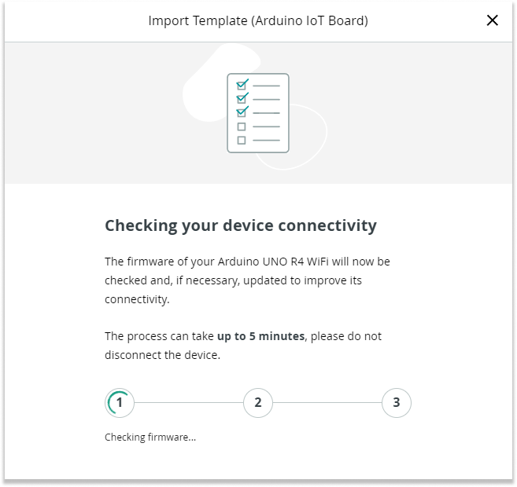
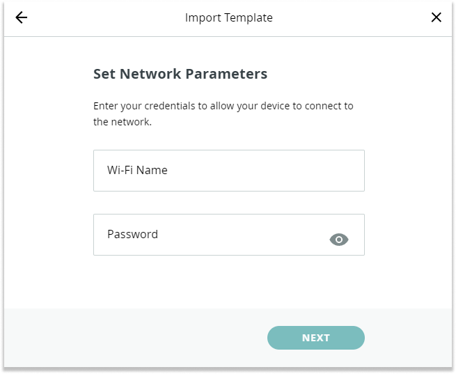

In this article, you'll learn the step-by-step process for importing an Arduino Cloud template.

## Import a Template

1. Go to [IoT Templates](https://app.arduino.cc/templates) and select a template.

1. Click the **Import Template** button.

1. Plug in your device and wait for it to be detected. Once the device is detected, click on **Configure** to continue.

    

1. Now that your device is detected and connected, the firmware of your Arduino device will be checked and updated if necessary to enhance connectivity. Follow the on-screen steps to proceed.

    

1. Once the device setup is complete, enter your network credentials.

    

---

## Still need help?

* [If you can't import a template in Arduino Cloud](https://support.arduino.cc/hc/en-us/articles/4408887422994-If-you-can-t-import-a-template-in-Arduino-Cloud)
* [If your device can't be added to Arduino Cloud](https://support.arduino.cc/hc/en-us/articles/360019355679-If-your-device-can-t-be-added-to-Arduino-Cloud)
