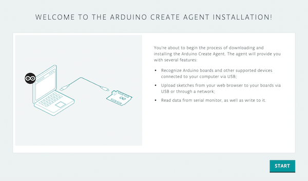

To use Arduino Cloud on regular systems (Windows, macOS, and Linux), you need the **Arduino Create Agent** to connect your physical boards/devices to the Cloud.

Learn how to install the Arduino Create Agent on your computer.

If you're using Chromebook, see [Use Arduino with Chromebook](https://support.arduino.cc/hc/en-us/articles/360016495639-Use-Arduino-with-Chromebook) instead.

---

## Install the Arduino Create Agent

Follow these steps:

1. Open the **[Arduino Create agent installation page](https://create.arduino.cc/getting-started/plugin/welcome)**

   

1. Click **START**.

1. Click **DOWNLOAD** to download the installer.

1. Leave your web browser open, and open your downloads folder.

1. Install the application:

   * **Windows:** Double-click the .exe installer and follow the instructions.
     * You may receive a security warning and be asked to approve installing a root certificate from Arduino. Choose **Yes** to install the certificate and proceed with the installation.
   * **macOS:** Double-click the .dmg file. Drag ArduinoCreateAgent.app into the Applications folder shortcut.
   * **Linux:** Extract the .tar.gz archive and double-click the .run file. Follow the instructions.

1. To confirm that the Create Agent is running, open your web browser with the Arduino Installation page.

1. When it's found, you will see this page. Click **NEXT** to finish the installation guide.

You can now use the Cloud Editor and Arduino Cloud:

* [Cloud Editor](https://support.arduino.cc/hc/en-us/articles/13809101080732-Open-the-Cloud-Editor)
* [Arduino Cloud](https://app.arduino.cc/)

---

## Troubleshooting

### General tips

* Be sure that you have **administrator permission** on your machine; if the computer you are using is not your own personal computer, ask your IT administrator for an upgraded profile.
* Sometimes the agent installation can be blocked by the firewall or antivirus software; in the latter case, you can try to **add the agent to your Antivirus whitelist**.

### Old agent installation of the Arduino Create Agent found

When trying to launch the Arduino Create Agent on macOS, you may get this error:

`Old agent installation of the Arduino Create Agent found, please uninstall it before launching the new one`.

The error can occur if an older installation is present. Follow these steps:

1. Open Finder and go to your user folder. If you're having trouble finding it, right-click Downloads or Documents in the sidebar, and select _Show in Enclosing Folder_, or press <kbd>Shift</kbd> + <kbd>⌘</kbd> + <kbd>H</kbd>.

2. Open the Applications folder (`~/Applications`) within your user folder.

3. Manually remove the ArduinoCreateAgent folder, or run the `uninstall.app` inside it.

Try launching Arduino Create Agent again.

---

## Further reading

* [List of releases on GitHub](https://github.com/arduino/arduino-create-agent/releases)

  Tags: como instalo la aplicacion

