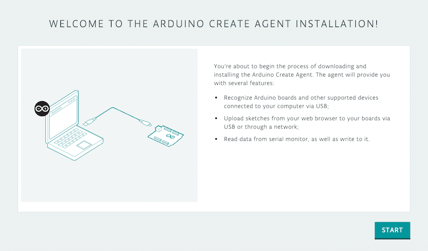
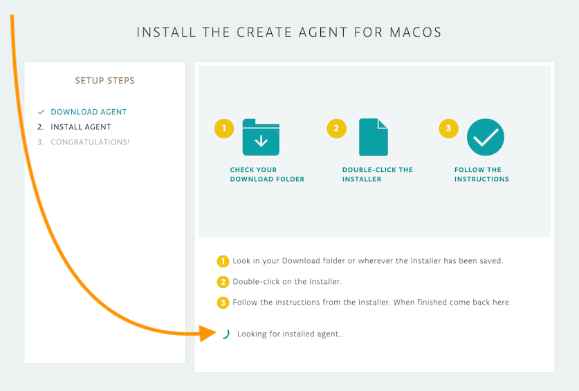
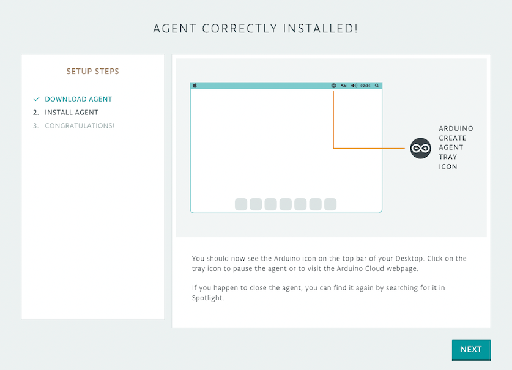

Arduino Cloud uses its own agent to be the middle man between Arduino's Web Editor and IoT Cloud and your computer. In this article we'll explain how to install it in your system (Windows, Mac, and Linux Ubuntu).

---

1. Open the [Arduino Create agent installation](https://create.arduino.cc/getting-started/plugin/welcome) page and click **Start**.

   

2. Click **Download** to download the installer. Go to your download folder, double-click the installer and follow the instructions. The installation guide will begin looking for the installed agent:

   * If you intend to user the Create Agent with a browser other than Google Chrome or Mozilla Firefox, make sure to answer Yes in the Browser Support step.
   * If you're installing the Create Agent for Windows, you may recieve a security warning and be asked to approve installing a root certificate from Arduino. Choose Yes to install the certificate and proceed with the installation.

   

3. When it's found, you will see this page. Click **Next** to finish the installation guide.

   

4. Start using the [Web Editor](https://create.arduino.cc/editor) and [IoT Cloud](https://cloud.arduino.cc/iot/things)!

## Troubleshooting

* Be sure that you have **administrator permission** on your machine; if the computer you are using is not your own personal computer, ask your IT administrator for an upgraded profile.
* Sometimes the agent installation can be blocked by the firewall or antivirus software; in the latter case, you can try to **add the agent to your Antivirus whitelist**.

  Tags: como instalo la aplicacion

