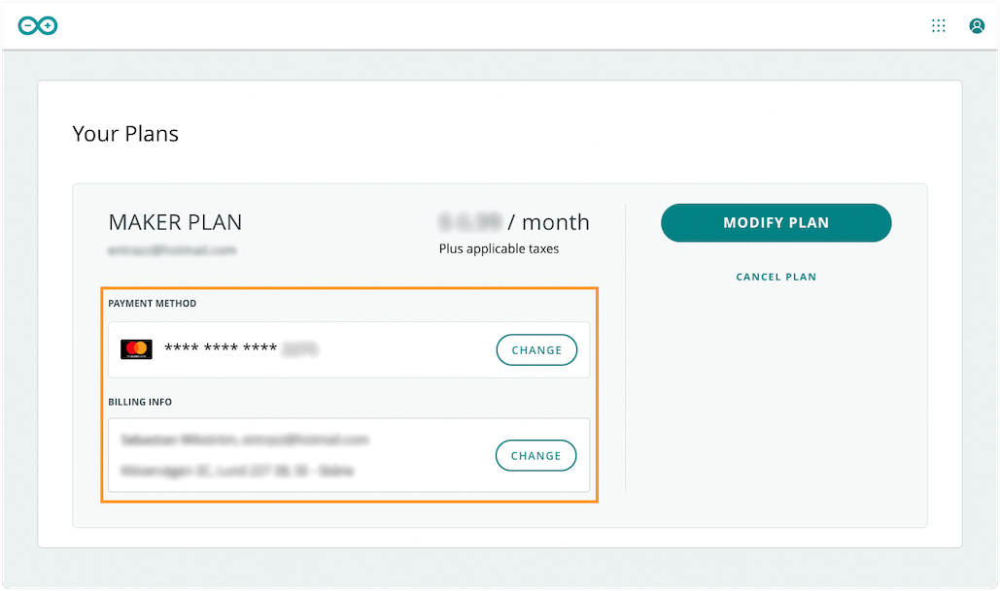
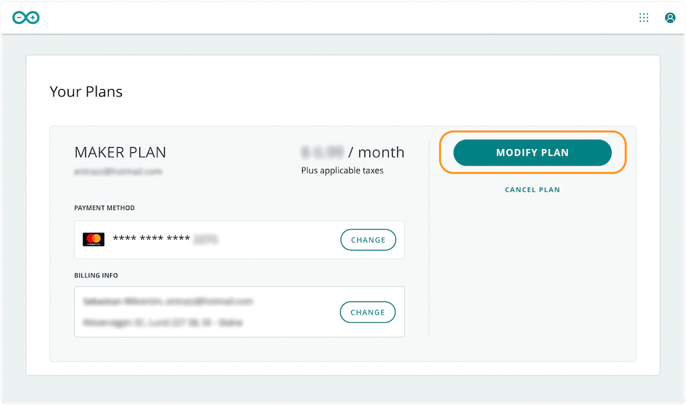
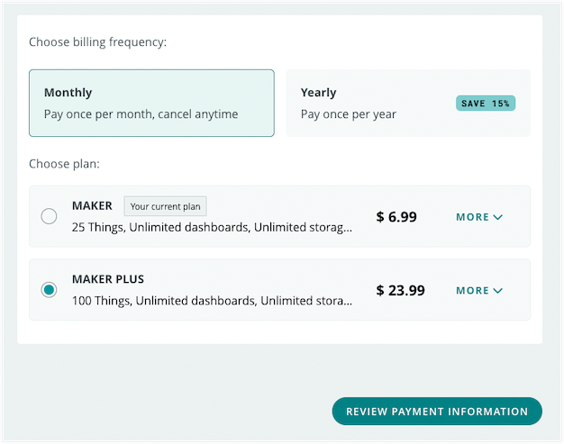

You can review, change or cancel your Arduino Cloud plan at any time:

* [Review your current plans](#review)
* [Understand where plan features are active](#space-plan-association)
* [Change payment method and billing info](#payment-and-billing)
* [Modify a plan](#switch)
* [Cancel a plan](#cancel)

---

## Review your current plans

1. Open the **My Plans** page by:
   * going directly to [digital-store.arduino.cc/subscriptions/plans](https://digital-store.arduino.cc/subscriptions/plans).
   * or clicking * > My Plans* from anywhere on the Arduino website (when signed in).
2. Review your plans and the subscription period, payment method, and billing info for any paid plans.

If you are part of any Cloud spaces with School or Enterprise plans, they will also appear on this page.

---

## Understand where plan features are active

Each plan is associated with a specific space in Arduino Cloud. Go to [My Plans](https://digital-store.arduino.cc/subscriptions/plans) to see where the features of each plan are active:

* Individual plans (Entry, Maker, and Maker Plus) increase the limits of your **Private Space**.
* Enterprise plans increase the limits of the shared space displayed below the text "Enterprise Plan".
* School plans increase the limits of the shared space under "Plan details".

---

## Change payment method and billing info

1. Open the **My Plans** page by:
   * going directly to [digital-store.arduino.cc/subscriptions/plans](https://digital-store.arduino.cc/subscriptions/plans).
   * or clicking * > My Plans* from anywhere on the Arduino website (when signed in).
2. Under **Payment method**, click CHANGE to update your payment method.
3. Under **Billing info**, click CHANGE to update your billing info.

Payment or billing info for School and Enterprise plans can only be changed by the **subscription admin**.

---

## Modify a plan

1. Open the **My Plans** page by:
   * going directly to [digital-store.arduino.cc/subscriptions/plans](https://digital-store.arduino.cc/subscriptions/plans).
   * or clicking * > My Plans* from anywhere on the Arduino website (when signed in).
2. Find the plan you want to change.
3. Click MODIFY PLAN.

   

4. Select your plan and billing frequency. You can switch to any plan you like, except the one that's currently active with your account.

   

5. Click REVIEW PAYMENT INFORMATION to continue.

> [!NOTE]
>
> * If the button is greyed out, the currently selected plan is already active with your account.
> * The Entry plan is only available as a yearly option.
> * Plan upgrades will take effect immediately. When downgrading your plan, you will retain access to your paid features until the end of the billing cycle. See [Billing and feature changes when switching to a different Cloud plan](https://support.arduino.cc/hc/en-us/articles/4401874211730) for more information.

School and Enterprise plans can only be modified by the **subscription admin**.

---

## Cancel a plan

1. Open the **My Plans** page by:
   * going directly to [digital-store.arduino.cc/subscriptions/plans](https://digital-store.arduino.cc/subscriptions/plans).
   * or clicking * > My Plans* from anywhere on the Arduino website (when signed in).
2. Find the plan you want to cancel.
3. Click 'Cancel plan'.

   

4. A confirmation message will be sent to the email address connected to your Arduino account.

> [!NOTE]
> You will retain access to your paid features until the end of the billing cycle. See [Billing and feature changes when switching to a different Cloud plan](https://support.arduino.cc/hc/en-us/articles/4401874211730) for more information.

School and Enterprise plans can only be canceled by the **subscription admin**.

---

## Further reading

* [Billing and feature changes when switching to a different Cloud plan](https://support.arduino.cc/hc/en-us/articles/4401874211730)
* [Read about exceeding plan limits when downgrading](https://support.arduino.cc/hc/en-us/articles/360019706820)
