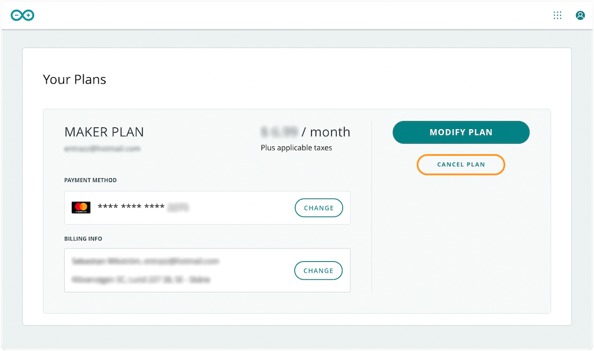

You can review, change or cancel your Arduino Cloud plan at any time:

* [Review your current plans](#review)
* [Change payment method and billing info](#payment-and-billing)
* [Switch to a different plan](#switch)
* [Cancel a plan](#cancel)

---

## Review your current plans

1. Open the **My Plans** page by
   * going directly to [store.arduino.cc/digital/subscriptions/plans](https://store.arduino.cc/digital/subscriptions/plans)
   * or clicking * > My Plans* from anywhere on the Arduino website (when signed in).
2. Review your plans and the subscription period, payment method, and billing info for any paid plans.

---

## Change payment method and billing info

1. Open the **My Plans** page by
   * going directly to [store.arduino.cc/digital/subscriptions/plans](https://store.arduino.cc/digital/subscriptions/plans)
   * or clicking * > My Plans* from anywhere on the Arduino website (when signed in).
2. Under **Payment method**, click CHANGE to update your payment method.
3. Under **Billing info**, click CHANGE to update your billing info.

---

## Switch to a different plan

1. Open the **My Plans** page by
   * going directly to [store.arduino.cc/digital/subscriptions/plans](https://store.arduino.cc/digital/subscriptions/plans)
   * or clicking * > My Plans* from anywhere on the Arduino website (when signed in).
2. Find the plan you want to change.
3. Click MODIFY PLAN.

   

4. Select your plan and billing frequency. You can switch to any plan you like, except the one that's currently active with your account.

   

5. Click REVIEW PAYMENT INFORMATION to continue.

> **Note:**
>
> * If the button is greyed out, the currently selected plan is already active with your account.
> * The Entry plan is only available as a yearly option.
> * Plan upgrades will take effect immediately. When downgrading your plan, you will retain access to your paid features until the end of the billing cycle. See [Billing and feature changes when switching to a different Cloud plan](https://support.arduino.cc/hc/en-us/articles/4401874211730) for more information.

---

## Cancel a plan

1. Open the **My Plans** page by
   * going directly to [store.arduino.cc/digital/subscriptions/plans](https://store.arduino.cc/digital/subscriptions/plans)
   * or clicking * > My Plans* from anywhere on the Arduino website (when signed in).
2. Find the plan you want to cancel.
3. Click 'Cancel plan'.

> **Note:** You will retain access to your paid features until the end of the billing cycle. See [Billing and feature changes when switching to a different Cloud plan](https://support.arduino.cc/hc/en-us/articles/4401874211730) for more information.

---

## Further reading

* [Billing and feature changes when switching to a different Cloud plan](https://support.arduino.cc/hc/en-us/articles/4401874211730)
* [Read about exceeding plan limits when downgrading](https://support.arduino.cc/hc/en-us/articles/360019706820)
