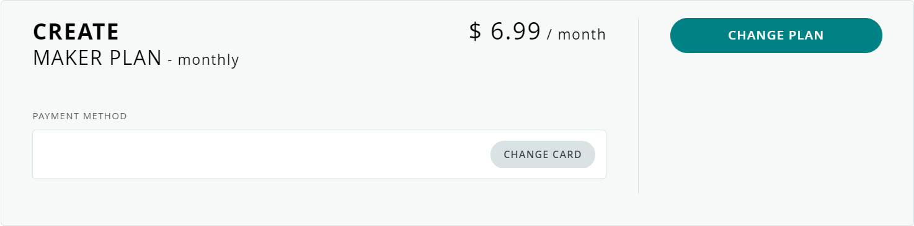
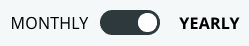

At any time you can change between the different Cloud plans, and switch between monthly and yearly billing.

---

## Review your current plan

You can review your active subscriptions on the [My Plans](https://store.arduino.cc/digital/subscriptions/plans) page, which can be opened anywhere on the Arduino website by clicking the  button in top-right, and then *My Plans*.

---

<h2 id="change">Change your plan</h2>

Next to your current Cloud plan, press the 'Change Plan' button.

You will be taken to the [Digital Store](https://store.arduino.cc/digital/create#plans).

You can choose between the monthly and yearly options with the switch button.

You can switch to any plan you like, except the one that's currently active with your account.

> **Note:** The Entry plan is only available as a yearly option.

---

## Cancel your plan

If you no longer wish to subscribe to a paid plan you can simply [switch](#change) to the free plan, canceling all future charges. You will retain access to your paid features until the end of the billing cycle. [Read more about billing after plan changing your plan here](https://support.arduino.cc/hc/en-us/articles/4401874211730).

---

### Further reading

* [Billing and feature changes when switching to a different Cloud plan](https://support.arduino.cc/hc/en-us/articles/4401874211730)
* [Read about exceeding plan limits when downgrading](https://support.arduino.cc/hc/en-us/articles/360019706820)
