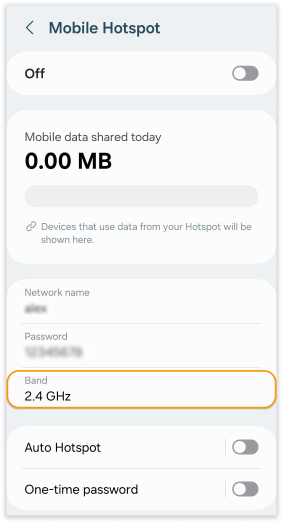

## Use 2.4 GHz Band for IoT Devices

Arduino boards and most IoT devices can only be used with 2.4 GHz band networks. The 2.4 GHz band offers better range and signal strength through obstacles compared to 5 GHz.

## How to Check if Your Network is 2.4 GHz

Follow these steps to identify the frequency band of your Wi-Fi.

**Windows:**

1. Open the settings menu in Windows and select the **Network and Internet** section.

1. Under the wireless network settings, click on the **Hardware properties** link.

1. A properties page will open. Here, you can find details about the wireless network, including the network band (GHz).

**macOS:**

1. Click on the Apple menu in the top-left corner of your screen and select **System Preferences**.

1. In the System Preferences window, click on the **Network** icon.

1. Select the Wi-Fi connection from the list on the left-hand side. Click on the **Advanced** button in the bottom-right corner.

1. In the **Wi-Fi** tab, you'll find information about the Wi-Fi connection, including the frequency band (GHz).

## Creating a 2.4 GHz Network with a Hotspot

If your network operates on the 5 GHz band, a quick solution is to create a 2.4 GHz network using the hotspot feature on an Android or iPhone device. iPhone hotspots typically prioritize the 2.4 GHz band by default. Android devices offer users the option to manually select their preferred band for hotspot connections.

