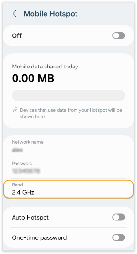

Arduino boards and most IoT devices can only be used with 2.4 GHz band networks. The 2.4 GHz band offers better range and signal strength through obstacles compared to 5 GHz.

## How to check if your network is 2.4 GHz

Follow these steps to identify the frequency band of your Wi-Fi network.

**Windows:**

1. Open the settings menu in Windows and select the **Network and Internet** section.

1. Under the wireless network settings, click on the **Hardware properties** link.

1. A properties page will open. Here, you can find details about the wireless network, including the network band (GHz).

**macOS:**

1. Connect to the Wi-Fi network.

1. Click on the Wi-Fi icon on the right side of the top navigation bar while holding down the Option/Alt key.

1. Look for the entry starting with Channel. This will specify if the network is in the 2.4 GHz or 5 GHz band.

## Creating a 2.4 GHz network with a hotspot

If your network operates on the 5 GHz band, a quick solution is to create a 2.4 GHz network using the hotspot feature on an Android or iPhone device. iPhone hotspots typically prioritize the 2.4 GHz band by default. Android devices offer users the option to manually select their preferred band for hotspot connections.

