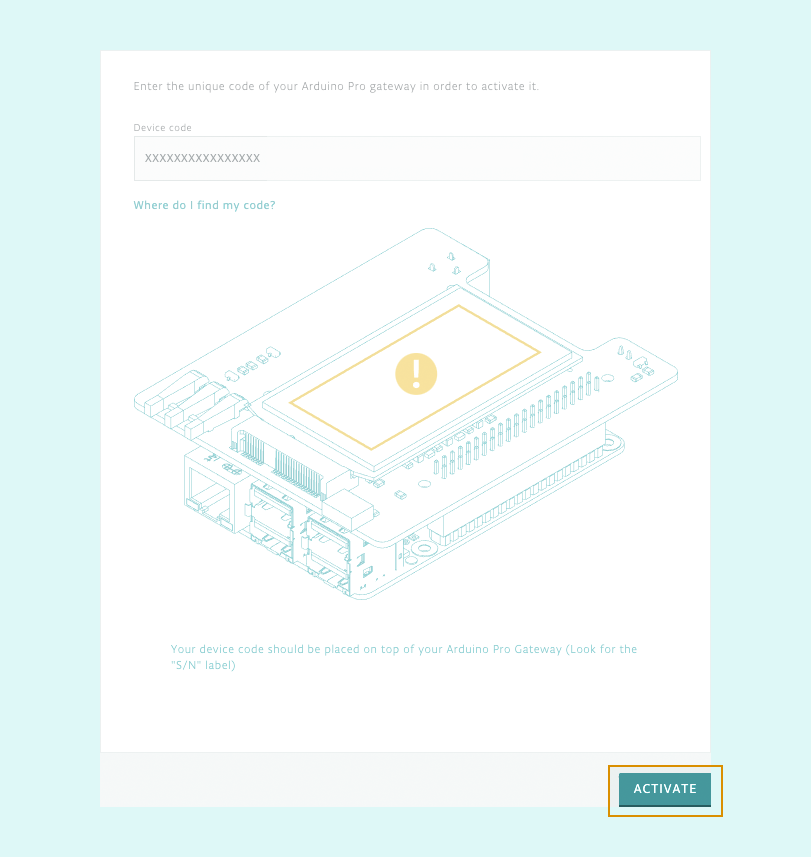
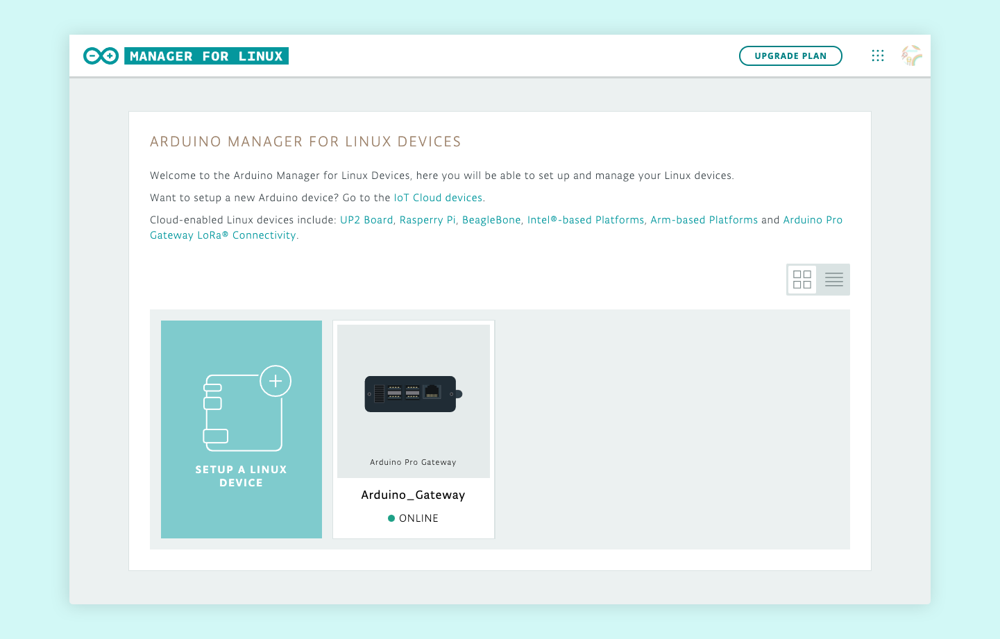

## Activate a gateway

1. Open the [Arduino Pro Gateway Setup](https://create.arduino.cc/getting-started/loragw).
2. Name your device.
3. Enter the **device code** (serial number). You'll find the code labeled **S/N** on top of the gateway.
4. Click the **ACTIVATE** button (you may have to scroll down).
5. Wait for activation to complete.

> Refresh the page if the activation appears to be stuck.

Your device should now appear in your Linux devices.

## Troubleshooting

### If activation does not complete

Refresh the page if activation does not proceed automatically when the progress bar is full.

### If the device does not come online

* Restart your gateway by disconnecting and reconnecting the power cable.
* If the gateway is activated with a different account, you first need to [deactivate it](https://support.arduino.cc/hc/en-us/articles/4407770459410) using that account. The Arduino Pro Gateway can only be activated with one Arduino account at a time.

## Still need help?

[Contact us](https://www.arduino.cc/en/contact-us/). Please provide the following information:

* Your Arduino account username
* The Gateway serial number.
