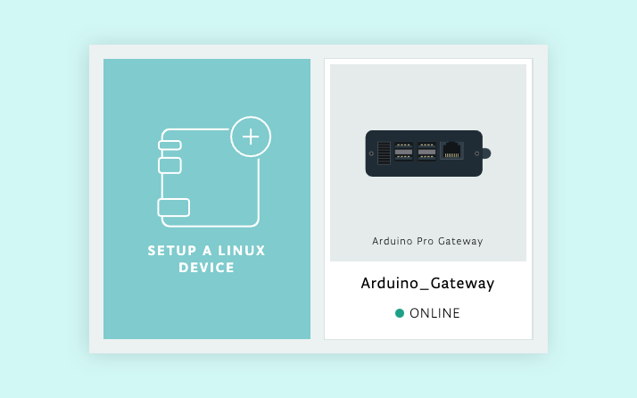
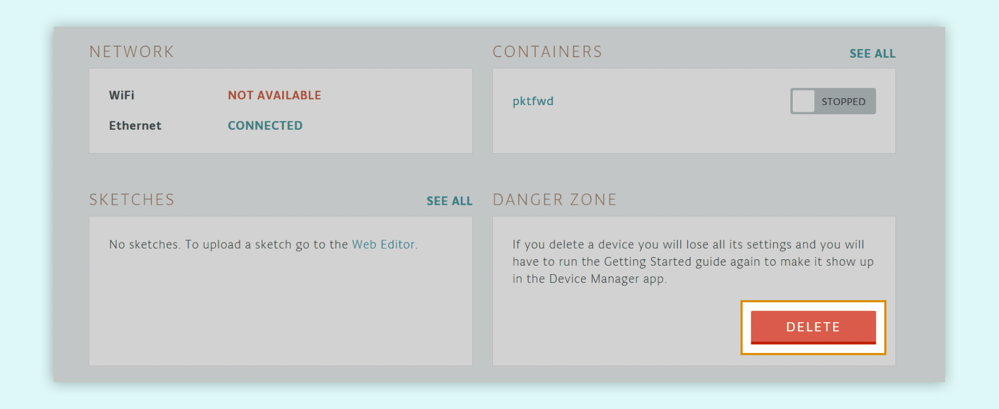

Deactivate an Arduino Pro Gateway with IoT Cloud using Manager for Linux.

## Deactivate a gateway

1. Turn on the gateway and connect it to the Internet.
2. Open [Manager for Linux](https://create.arduino.cc/devices/) and wait for the device to come online.
3. Click the device.

   

4. Under _Danger Zone_, click the Delete button. All sketches and custom docker images on the gateway will be deleted.

   

## Still need help?

[Contact us](https://www.arduino.cc/en/contact-us/). Please provide the following information:

* Your Arduino account username
* The Gateway serial number.
