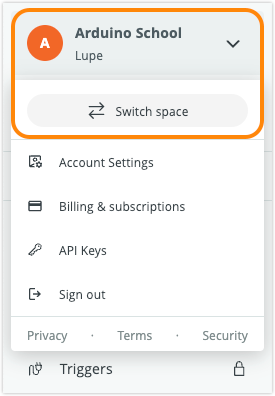

Learn how use Cloud plan features in Spaces in Arduino Cloud.

In this article:

* [About Cloud plans](#about-cloud-plans)
* [Check plan type and usage in your current space](#check-plan-type-and-usage)
* [Check which plans you can access](#check-plan-access)

Related articles:

* [Review, change, or cancel an Arduino Cloud plan](https://support.arduino.cc/hc/en-us/articles/4401881299090-Review-change-or-cancel-an-Arduino-Cloud-plan)

---

## About Cloud plans{#about-cloud-plans}

* A Cloud plan is active in a particular space. Individual plans (Entry, Maker, and Maker Plus) increase the features of your Private Space, while School and Enterprise plans increase the features of a shared School or Enterprise space.
* When creating a new Thing or Trigger, they are added to the currently selected space and are counted against the space's plan usage. A Maker plan (or any individual plan) will not increase the limits of an Enterprise space, and an Enterprise plan will not increase the features of your Private space.

---

## Check plan type and usage for a space{#check-plan-type-and-usage}

Follow these steps:

1. Go to [app.arduino.cc](https://app.arduino.cc/)

2. The name of the selected space is displayed at the top of the left sidebar.

3. To change the selected space, click on the space name and select **Switch space** in the menu.

   

4. Open the **Plan Usage** page:

   * Private Space: Click Plan Usage in the sidebar.
   * Shared Space: Click Space Settings in the sidebar, then click Plan Usage.

5. Review the plan information:

   * The name of the active plan is displayed under the text "Your plan".
   * The feature usage for Compilation, Storage, Things, and Triggers.

[Click here to open the Plan Usage page for your selected space](https://app.arduino.cc/plan-usage){.link-external}

---

## Check which plans you can access{#check-plan-access}

If you're a member of a space that has an active, paid Cloud plan, the plan will appear on your **Plans page**.

Follow these steps:

1. Go to [digital-store.arduino.cc/subscriptions/plans](https://digital-store.arduino.cc/subscriptions/plans)
2. Review the active plans:
   * Individual plans (Entry, Maker, and Maker Plus) increase the limits of your **Private Space**. If you're not subscribing to any paid Individual plan, the Free plan will be active.
   * Enterprise plans increase the limits of the shared Enterprise space displayed below the text "Enterprise Plan".
   * School plans increase the limits of the shared School space under "Plan details".

---

## If you need help

If you need help with your Arduino Cloud plan, please [contact us](https://www.arduino.cc/en/contact-us/).