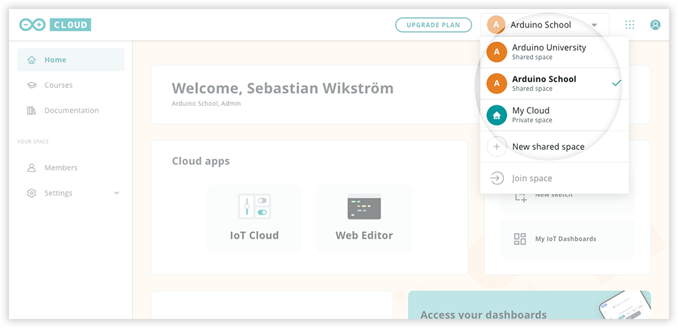
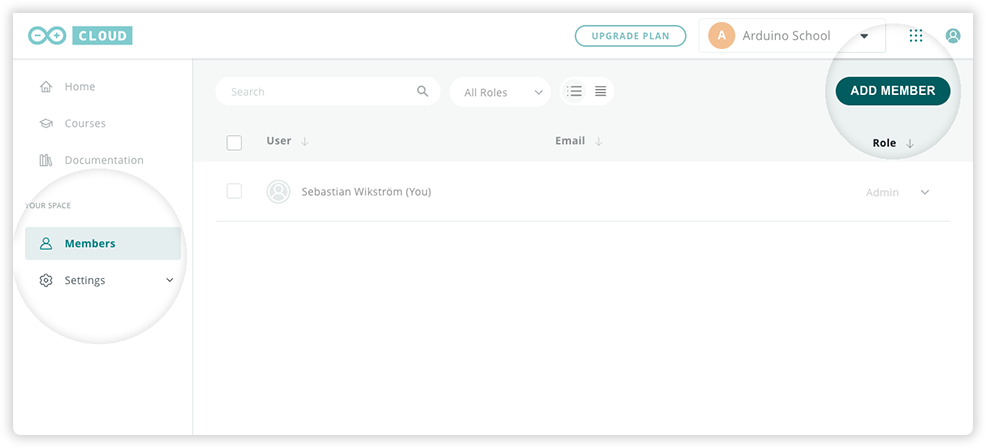
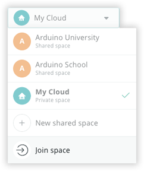

Learn how to invite new members to a shared space in Arduino Cloud.

---

1. Go to [cloud.arduino.cc](https://cloud.arduino.cc/).

2. Select the shared space in the top-right dropdown menu.

   

3. Open the **Members** tab and click on the **Add Member** button.

   

4. Invite members:

   * **To invite via email:** enter one or more email addresses separated by spaces. Select a role to assign to users that already have an Arduino account. If they don't have an account, they will be asked to create one when joining the space but will be added as students. Their role can be changed by admins once they've joined the space. Click **Invite** to send the invites.

     

   * **To invite with a code/link:** Either share the link (click on "link" to copy) or just the code.

     

     Students can join using the code by going to [cloud.arduino.cc](https://cloud.arduino.cc/) and selecting "Join space" in the space dropdown.

     

---

## Controlling access to your space

If an Arduino account is _not_ associated with the email, the invite link will include a reusable invite code (the same code that can be copied from the student invite view). Only invite trusted users with this method since this code can be shared with other users.

---

## If the invite email is not received

* Have the recipient check their spam folder.
* Ensure that the network allows receiving outside email.
