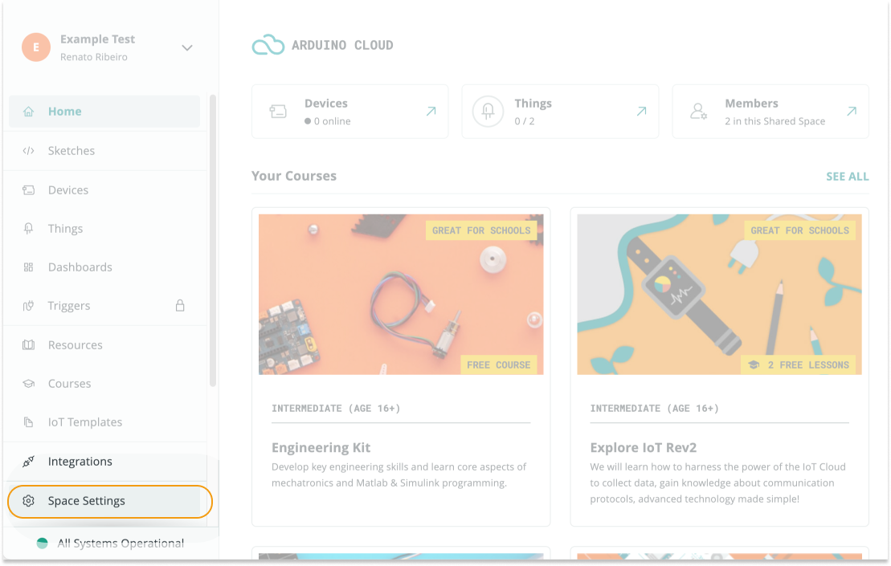

Learn how to invite new members to a shared space in Arduino Cloud.

---

1. Go to [app.arduino.cc](https://app.arduino.cc/)

2. Select the shared space in the top-left dropdown menu. (If you have more than 3 spaces, a **Switch space** button will appear in the dropdown menu. Click this button and select the shared space in the pop-up window.)

   

3. In the leftmost sidebar, click on **Space Settings** to expand the options.

   

4. In the **Manage Members** tab, click on the **ADD MEMBERS** button.

   

5. **Invite members via email:** enter one or more email addresses separated by spaces. Select a role to assign to users that already have an Arduino account. If they don't have an account, they will be asked to create one when joining the space but will be added as students. Their role can be changed by admins once they've joined the space. Click **Invite** to send the invites.

   

6. **Invite with a link/code:**

   * Share the link (click on "link" to copy) with a student.

   * Or share the code with a minor student. If the minor student does not belong to any Educational space, an orange banner will be shown in the sidebar when the student opens Arduino Cloud. Clicking on it will open a text-box that allows the student to join the space by inserting the code.

     

---

## Controlling access to your space

If an Arduino account is _not_ associated with the email, the invite link will include a reusable invite code (the same code that can be copied from the student invite view). Only invite trusted users with this method since this code can be shared with other users.

---

## If the invite email is not received

* Have the recipient check their spam folder.
* Ensure that the network allows receiving outside email.
