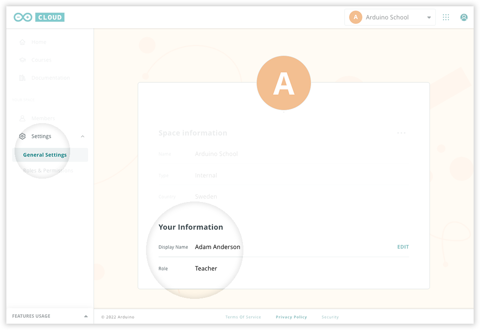

If you are part of a space, you can find your educator role by following the steps below.

---

1. Go to [cloud.arduino.cc](https://cloud.arduino.cc/).

2. Select the shared space in the top-right dropdown menu.

   

3. To quickly see your own role, click **Settings > General Settings** and look under **Your Information**.

   

4. **See all member roles:** In the menu on the left, click **Members**. See the "Role" column for each member in the list.

   
