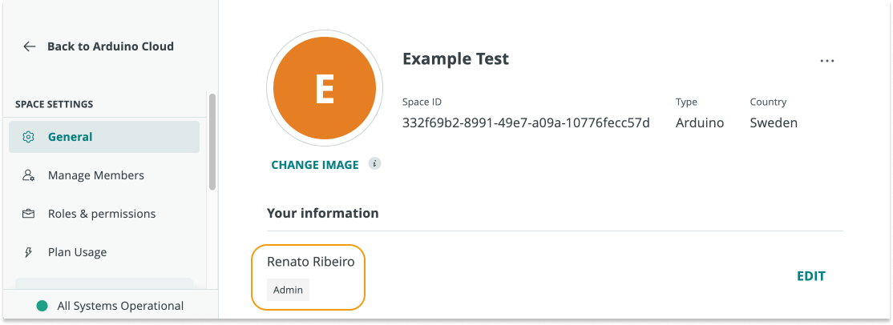
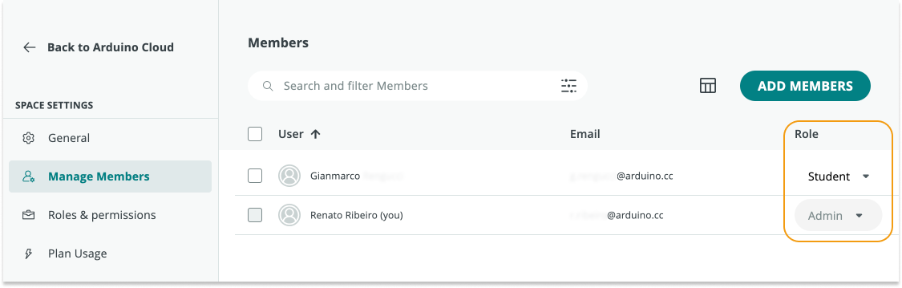

If you are part of a space, you can find your educator role by following the steps below.

---

1. Go to [app.arduino.cc](https://app.arduino.cc/)

2. Select the shared space in the top-left dropdown menu. (If you have more than 3 spaces, a **Switch space** button will appear in the dropdown menu. Click this button and select the shared space in the pop-up window.)

   

3. In the leftmost sidebar, click on **Space Settings** to expand the options.

   

4. To quickly see your own role, click **General** in the leftmost sidebar, and look under **Your Information**.

   

5. To **see all member roles**, click **Manage Members** in the leftmost sidebar. See the Role column for each member in the list.

   
