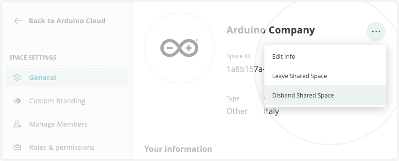

Learn about disbanding a space in Arduino Cloud.

In this article:

* [Before you disband a space](#before-you-disband-a-space)
* [How to disband a space](#how-to-disband-a-space)

---

## Before you disband a space{#before-you-disband-a-space}

Here's what you should know before disbanding a space:

* Any courses shared with the space will be returned to the owner's Private Space.
* The members will lose access to any School plan or Enterprise plan that was activated for the space.

---

## How to disband a space{#how-to-disband-a-space}

Follow these steps:

1. Go to [app.arduino.cc](https://app.arduino.cc/)

2. Observe the name of the selected space is displayed at the top of the left sidebar.

3. To change the selected space, click on the space name and select **Switch space** in the menu.

4. Select the **Space Settings** tab in the sidebar.

5. Click the three dots in the top-right corner and choose **Disband space**.

   
