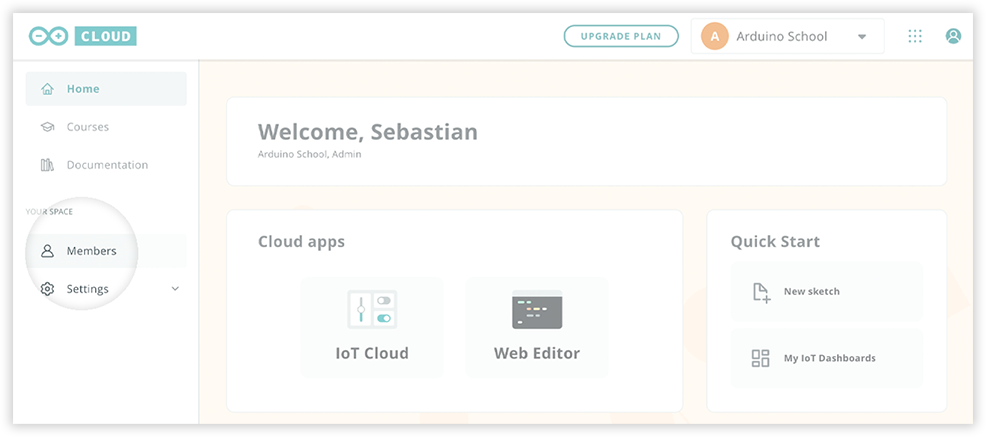
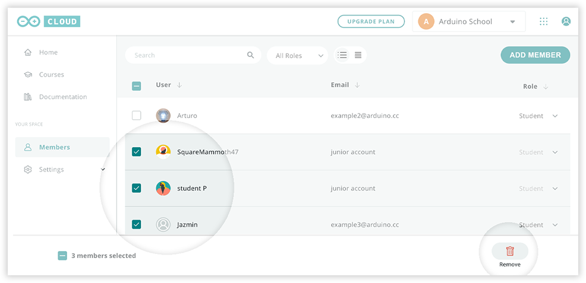
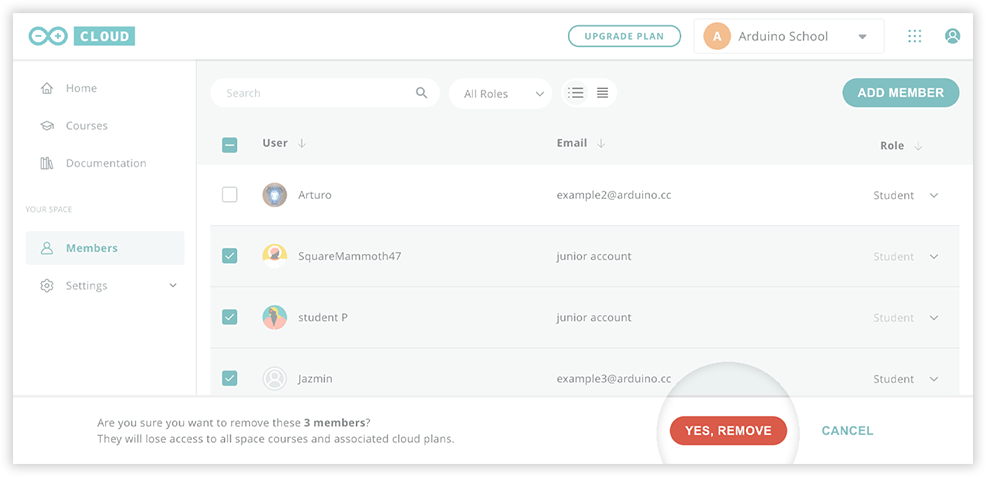

You can remove members from space depending on your role:

* **Teachers** can remove **Students**
* **Admins** can remove any member.

Follow these steps below to remove members:

1. Go to [cloud.arduino.cc](https://cloud.arduino.cc/) and select a space in the top-right dropdown menu.

   

2. Open the members tab.

   

3. Select one or more members by clicking the checkboxes, then click **Remove**.

   

4. Click **"Yes, Remove"** to confirm.

   
