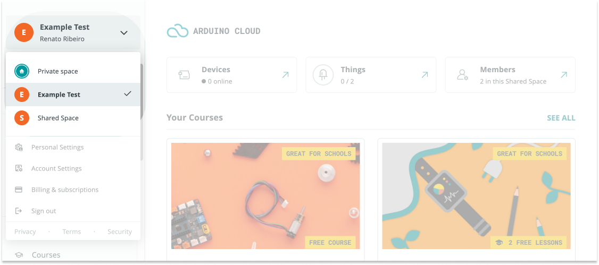

## Roles that can remove members

You can remove members from a space depending on your role:

* **Teachers** can remove **Students**
* **Admins** can remove any member.

## How removed members are affected

* Removed members keep their Arduino accounts
* Removed members will no longer have access to courses shared with the space.
* The removed member will keep their data, but will no longer benefit from additional features and limits provided by any **School plan** active with the space. Some features may be restricted if they exceed the limits of their personal plan. See [If you exceed plan limits after downgrading](https://support.arduino.cc/hc/en-us/articles/4401874212370-If-you-exceed-plan-limits-after-downgrading).

## Remove a member from a space

Follow the steps below to remove members:

1. Go to [app.arduino.cc](https://app.arduino.cc/)

2. Select the shared space in the top-left dropdown menu. (If you have more than 3 spaces, a **Switch space** button will appear in the dropdown menu. Click this button and select the shared space in the pop-up window.)

   

3. In the leftmost sidebar, click on **Space Settings** to expand the options.

   

4. In the **Manage Members** tab, select one or more members by clicking the checkboxes, then click **Remove**.

   

5. Click **"GO AHEAD"** to confirm.

   
