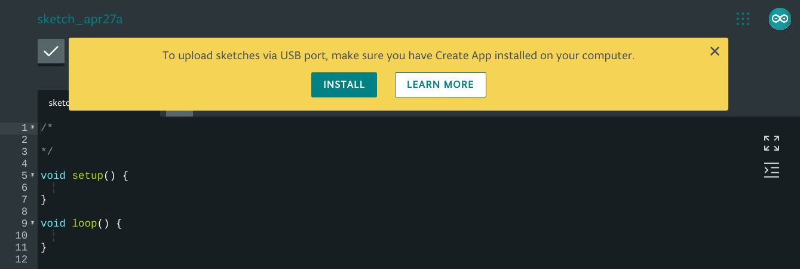

> The Create App for Chrome OS used to require a paid subscription but is now free of charge.

Using the [Arduino Web Editor](https://create.arduino.cc/editor) on Chrome OS requires the [Arduino Create App](https://chrome.google.com/webstore/detail/elmgohdonjdampbcgefphnlchgocpaij) to be able to upload sketches to a board. This is called the Arduino Create Agent on other operating systems.

*Opening the Web Editor without the Create App will trigger an installation prompt.*

## Getting started

1. Install the [Arduino Create App (Chrome Web Store)](https://chrome.google.com/webstore/detail/elmgohdonjdampbcgefphnlchgocpaij).

2. Open the [Web Editor](https://create.arduino.cc/editor). (You will be asked to sign in to your Arduino account if you aren't already. Read more about [creating Arduino accounts here](https://support.arduino.cc/hc/en-us/articles/360016724040-How-to-create-an-Arduino-account).)

If a yellow banner is displayed, the Web editor could not detect the Create App. Make sure it is installed.

School computers and networks may restrict installation. Contact your local IT administrator for help.

The Web editor will detect the Chrome App automatically and you start writing and uploading code to your board.

For further instructions on how to use the Web Editor, visit the [getting started article](https://create.arduino.cc/projecthub/Arduino_Genuino/getting-started-with-arduino-web-editor-on-various-platforms-4b3e4a) or the Help Centers [Web Editor section](https://support.arduino.cc/hc/en-us/sections/360004605460-Web-Editor).

## Educational use

Since the app is now free, there is no longer a need to sign up for a subscription plan. Simply have the Create App installed on each computer, either by the students themselves or by an IT administrator.

<!-- NOTE: The Chrome web store page links to this page!
           https://chrome.google.com/webstore/detail/arduino-create-for-educat/elmgohdonjdampbcgefphnlchgocpaij
           -->
