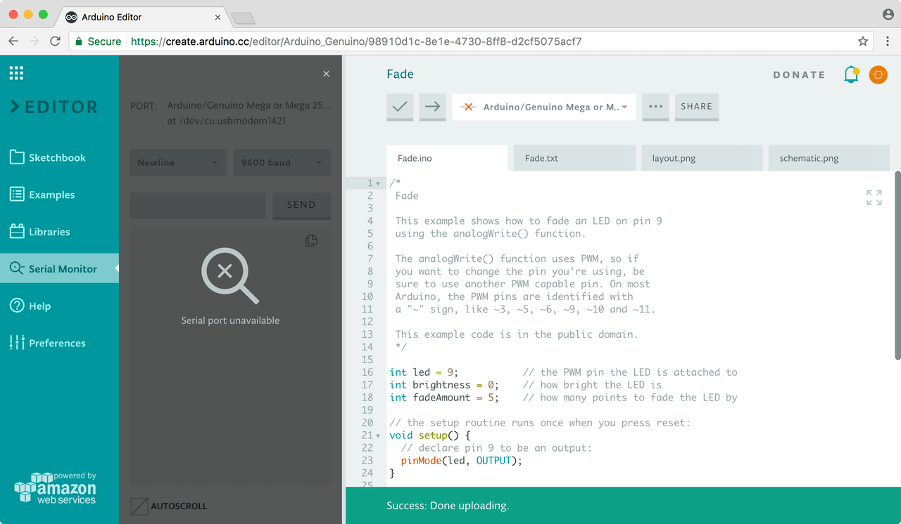

If you are trying to connect your Arduino board to the Arduino Web Editor and you find a red cross near your device, it means that the Web Editor is not detecting the board as connected to your computer.

First of all, please check that the board chosen corresponds with the one connected and the port selected.

If you are using a Chromebook, please note that you will need to have the Arduino Chrome App installed.

* If you purchased the Arduino Create app from the Chrome Web Store as a single user this is the link to the app you must install: [Arduino Create Single User](https://chrome.google.com/webstore/detail/arduino-create/dcgicpihgkmccjigalccipmjlnjopdfe?hl=en).

* If you are part of a school or organizations that owns an Arduino Chrome App plan for education you must obtain the app from this other link [Chrome App for Education](https://chrome.google.com/webstore/detail/arduino-create-for-educat/elmgohdonjdampbcgefphnlchgocpaij)
