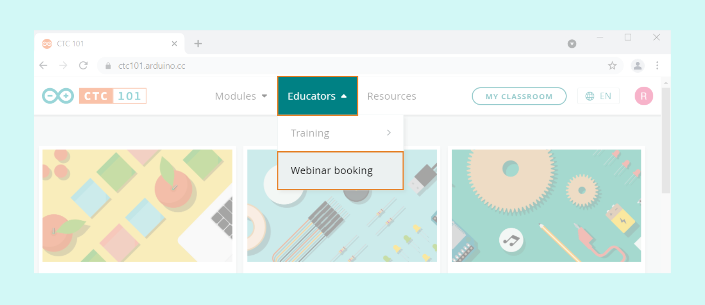
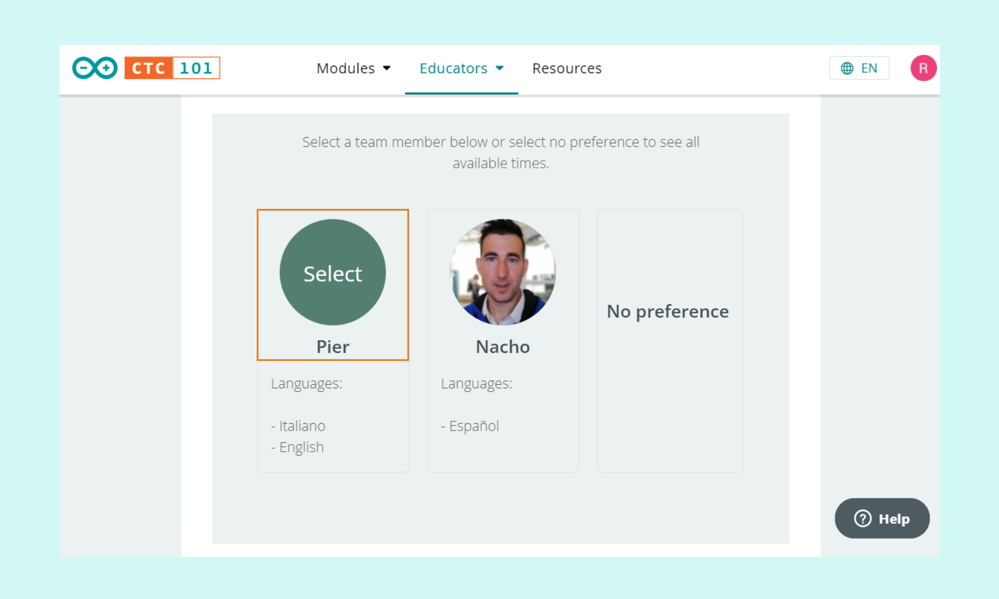
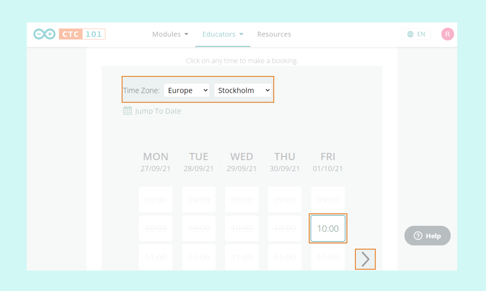
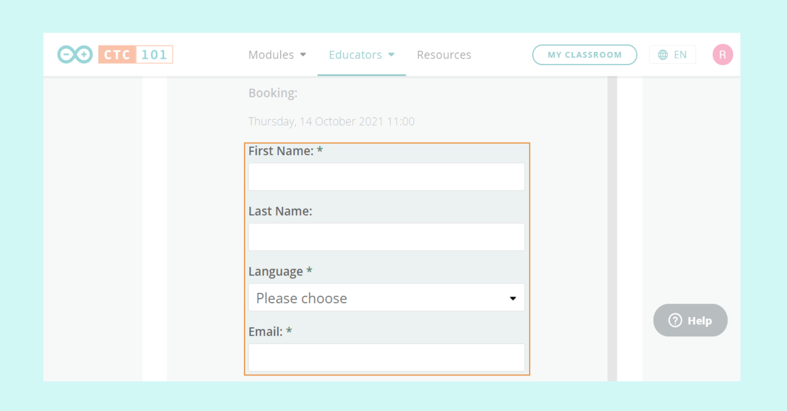
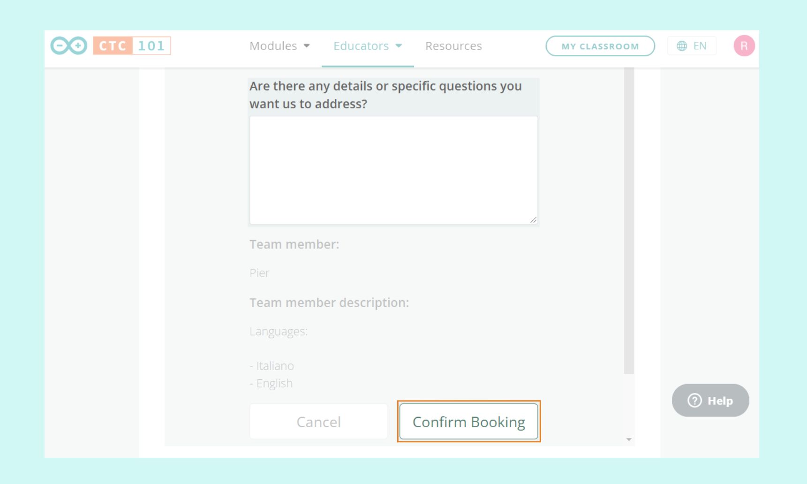

Learn how to book a webinar for CTC 101 with an Arduino Education expert.

---

## Open the Webinar Booking page

1. Go to the [Arduino CTC 101 course page](https://ctc101.arduino.cc/).
2. Click on **Educators**.
3. Select **Webinar Booking** in the dropdown menu.

## Select an Arduino Education Team Member

Choose a team member according to your language preferences.

## Choose a date

1. Select the correct time zone for your location.
2. Select an available time slot. Different weeks can be viewed by clicking the arrow buttons.

## Add information and select language

1. Add your name.
2. Select a language on the **Language** dropdown menu.
3. Add your email address.

## Confirm your booking

1. Add any additional information if necessary.
2. Click **Confirm Booking** at the bottom of the form on the right.

You will receive a confirmation email after the booking is completed.
