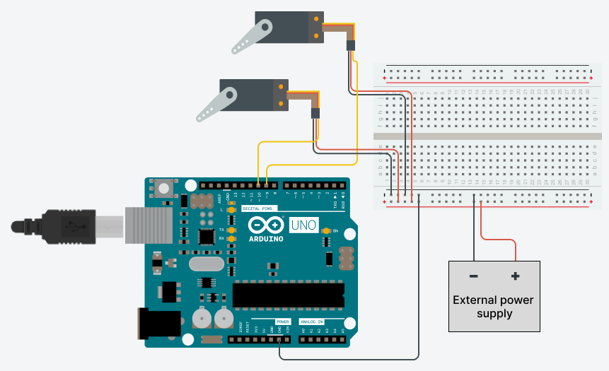

Learn how to troubleshoot servos that are not moving or moving erratically.

---

## Quick checks

1. **Check connections:**

    * Make sure the connection between the servo and the board is correct. Check the [Basic servo control tutorial](https://docs.arduino.cc/tutorials/generic/basic-servo-control) for a circuit diagram example.

2. **Verify Pin Configuration:**

    * Confirm that you've connected the servo to the same pin mentioned in the code. For example, if you are using the [servo library](https://www.arduino.cc/reference/en/libraries/servo/), the code might inlcude a line such as `myservo.attach(9)` to link the servo to a specific pin on the board. In this case, the **signal** input on the servo should be connected to the pin 9 on the board.

3. **Power Considerations:**

    * Servo motors draw significant power, and the board might not supply enough energy. If you need to drive more than one or two servos, you may need to power them from a separate supply (i.e. not the 5V pin on your Arduino). Make sure the grounds of the Arduino and the external power supply are connected. Check the diagram below for an example circuit:

        

## Further reading

* <a class="link-external" href="https://www.arduino.cc/reference/en/libraries/servo/">Servo library reference</a>
