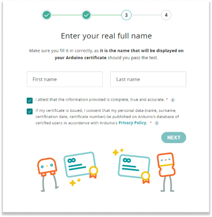

Are you ready to get certified with Arduino? This guide will walk you through purchasing, accessing, and activating your exam activation code.

---

## Where to purchase Arduino Certifications

To purchase your Exam Activation code, visit the following link: [Arduino Certification Purchase](https://digital-store.arduino.cc/certification/purchase/exam-type)

## How to access your exam activation code

After purchasing, you will receive an email with the subject "Thank you for purchasing Arduino Certification!". This email will contain your exam activation code.

If you cannot find the email, try checking your spam folder.

## How to activate the exam activation code

To activate your certification code and start the exam, follow these steps:

1. Go to [Arduino Certification Portal](https://certifications.arduino.cc/).

1. Select your preferred exam language.

    

1. Enter your exam activation code.

    

1. Fill in your first and last name in the dedicated fields. Check the two checkmark boxes to agree to the terms.

    

1. Now you're ready to start your exam!

    

## What to do if you can't find the exam activation code

If you cannot find your exam activation code, please contact [Arduino's customer support](https://www.arduino.cc/en/contact-us/) for assistance.
