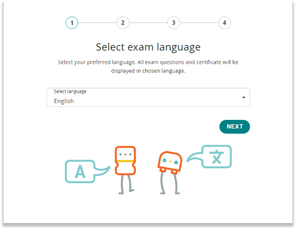

Arduino Certification is an online exam that provides official certification on your knowledge of Arduino-related electronics, programming, and physical computing. Learn how to purchase and take the exam. Learn how to purchase, activate, and start your exam.

---

## Purchase an exam activation code

To attempt the exam, you need an exam activation code.

Exam codes can be purchased individually or as part of a bundle:

* [Purchase an individual exam code](https://digital-store.arduino.cc/certification/purchase/exam-type).
* Purchase a certification bundle that includes an activation code:
  * [Arduino Certification Bundle](https://store.arduino.cc/products/arduino-fundamentals-bundle), which includes an activation code for the **Arduino Certification exam** along with the Arduino Starter Kit.
  * [Arduino Junior Certification Bundle](https://store.arduino.cc/products/junior-certification-bundle), which includes an activation code for the **Junior Certification exam** along with the Arduino Student Kit.

## Find your exam activation code

**If you purchased an individual exam code:**

* After purchasing, you will receive an email with the subject "Thank you for purchasing Arduino Certification!". This email will contain your exam activation code.
* If you cannot find the email, follow these steps:

  1. Make sure you’re checking the correct email inbox.
  2. Check your spam folder.
  3. [Contact us](https://www.arduino.cc/en/contact-us/) for further assistance.

**If you purchased a certification bundle:**

* The exam activation code is inside an envelope included in the product packaging.

## Start the exam

To activate your certification code and start the exam, follow these steps:

1. Go to [certifications.arduino.cc](https://certifications.arduino.cc/) and select the exam you wish to start.

1. Select your preferred exam language.

    

1. Enter your exam activation code.

    

1. Fill in your first and last name in the dedicated fields. Check the two checkmark boxes to agree to the terms.

    

1. Now you're ready to start your exam!

    

---

## Further reading

* [Arduino Blog – Arduino Certification explained](https://blog.arduino.cc/2021/11/12/arduino-certification-explained/)
* [Arduino Certification FAQ](https://content.arduino.cc/assets/ACP%20FAQ.pdf)
