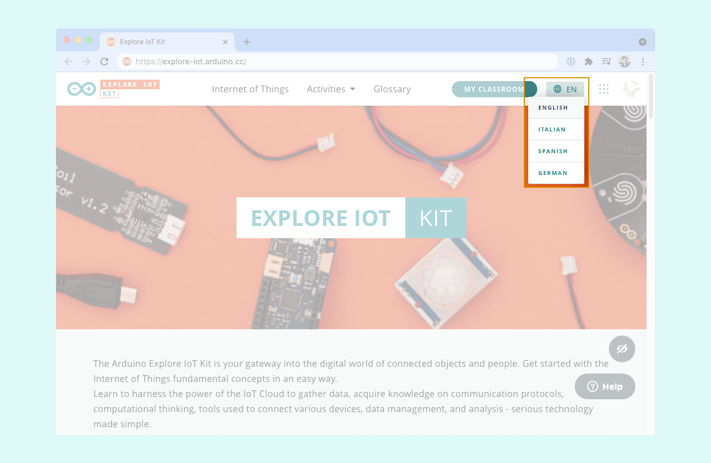

The online platforms of our educational kits are available in different languages. Learn how to select the language for your course.

---

## For most kits

1. Click on the button showing the currently selected language in the top right.
2. Click to select language.

## Science kit Physics Lab

1. Scroll down to the bottom of the page.
2. Click on the button showing the currently selected language in the bottom right.
3. Click to select language.

